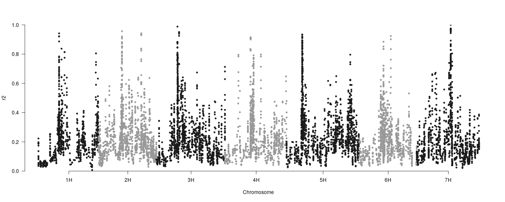
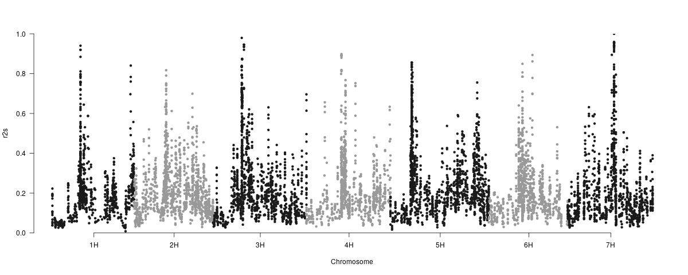

```{r knitr setup, include=FALSE,  eval=TRUE, echo=FALSE, warning=FALSE}
library(knitr)
knitr::opts_chunk$set(eval=TRUE, cache=FALSE, message=FALSE, warning=FALSE, 
                      comment = "", results="markup")
```

This document describes how linkage disequilibrium (LD) was computed from SNPs of 135 landraces of the Spanish Barley Core Collection (SBCC) by E Igartua and B Contreras.

r2 is calculated in four ways: the standard and three new measures of r2, correcting for population structure, with strategies similar to the Q, K and Q+K models in GWAS, r2s, r2v, and r2vs, respectively. These measures were first described by Mangin et al in 
[https://www.nature.com/articles/hdy201173](https://www.nature.com/articles/hdy201173)
and are implemented in R package [LDcorSV](https://cran.r-project.org/web/packages/LDcorSV/index.html). 
<!--Mangin, B., Siberchicot, A., Nicolas, S., Doligez, A., This, P., & Cierco-Ayrolles, C. (2012). Novel measures of linkage disequilibrium that correct the bias due to population structure and relatedness. Heredity, 108(3), 285.-->

## Formatting SNPs

The initial set of 9,920 Infinium and GBS markers in file [*9920_SNPs_SBCC_50K.tsv*](raw/9920_SNPs_SBCC_50K.tsv)
was converted as follows, allowing up to 10% missing data per position and accepting only biallelic loci (n=8455, after removing two htzg markers), just as done for the STRUCTURE analysis (file [*SBCC_9K_SNPs.structure.tsv*](SBCC_9K_SNPs.structure.tsv) was produced). The final list of SNPs is in file [*SBCC_LD_order.tsv*](LD/SBCC_LD_order.tsv).

Genotype files were prepared for each chromosome, including an artificial chromosome for markers of uncertain location,
with genotypes coded as 0, 2 & NA.
These CSV files are called [*Geno1H*](LD/Geno1H.csv), [*Geno2H*](LD/Geno2H.csv), [*Geno3H*](LD/Geno3H.csv), [*Geno4H*](LD/Geno4H.csv), [*Geno5H*](LD/Geno5H.csv), [*Geno6H*](LD/Geno6H.csv), [*Geno7H*](LD/Geno7H.csv) and
[*Genounk*](LD/Genounk_random.csv).

## Imputing missing data

Before moving on we can take these files, one per chromosome, and impute missing genotype calls 
with R package [linkim](https://cran.r-project.org/package=linkim), a linkage-based method for 
imputing missing diploid genotypes published with [doi:10.4172/2329-9533.1000115](https://doi.org/10.4172/2329-9533.1000115).
This method has some stochastic component as independent runs provide different results. 
For this reason the block code below has eval=FALSE so that it is compatible with LFMM results in
protocol [HOWTOLFMM](./HOWTOsnpsLFMM.html).

```{r impute, eval=FALSE}
library(linkim)

# set barley chr names
chrnames = c("1H","2H","3H","4H","5H","6H","7H")

# import data for all chromosomes (1H to 7H)
Geno = c()
Geno[[1]] = read.csv('LD/Geno1H.csv', header=TRUE, check.names = F, sep=";", row.names = 1)
Geno[[2]] = read.csv('LD/Geno2H.csv', header=TRUE, check.names = F, sep=";", row.names = 1)
Geno[[3]] = read.csv('LD/Geno3H.csv', header=TRUE, check.names = F, sep=";", row.names = 1)
Geno[[4]] = read.csv('LD/Geno4H.csv', header=TRUE, check.names = F, sep=";", row.names = 1)
Geno[[5]] = read.csv('LD/Geno5H.csv', header=TRUE, check.names = F, sep=";", row.names = 1)
Geno[[6]] = read.csv('LD/Geno6H.csv', header=TRUE, check.names = F, sep=";", row.names = 1)
Geno[[7]] = read.csv('LD/Geno7H.csv', header=TRUE, check.names = F, sep=";", row.names = 1)

# read corresponding map info, with markers in the same order as in CSV files
mapmarkers = read.table(file="LD/SBCC_LD_order.tsv",header=T,sep="\t",check.names = F)

# filename for imputed outfile
out_imp_TSV = "LD/SBCC_9K_SNPs.imputed.tsv"
unlink(out_imp_TSV)

for (c in 1:7){ 
  Genotypes = Geno[[c]]
  
  # convert allele calls 2 to 1
  Genotypes[Genotypes==2] <- 1
  
  # get markers from column names and sort them 
  chrmarkers = mapmarkers[ mapmarkers$chr==c, ]
  chrmarkers = chrmarkers[ complete.cases(chrmarkers), ]
  #chrmarkers = as.numeric(chrmarkers[ , c("cM") ]) # does not work with repeated cM positions
  chrmarkers = as.numeric(chrmarkers[ , c("bp") ])
  chrmarkers = chrmarkers / 1000000

  # impute  
  full.Genotypes = link.im(data=Genotypes,r=chrmarkers) #,trace = T)

  # transpose and print data
  full.Genotypes = t(full.Genotypes)
  write.table(full.Genotypes,file=out_imp_TSV,sep="\t",row.names=T,col.names=F,quote=F,append=T)    
}
```

A header is then added to this file:
```{r, engine='bash'}
perl -F";" -lane 'next if(/^;/); $h.="\t$F[0]"; END{print "marker$h"}' LD/Geno1H.csv > LD/header.tsv
cat LD/header.tsv LD/SBCC_9K_SNPs.imputed.tsv > SBCC_9K_SNPs.imputed.tsv
```
These operations produce file [*SBCC_9K_SNPs.imputed.tsv*](SBCC_9K_SNPs.imputed.tsv) (n=7477).
  
## Kinship matrix and population structure

A kinship matrix was modified from a square matrix of distances produced by TASSEL and saved as [*WAIS*](LD/WAIS.csv).
In addition, a file with probabilities of membership to K=4 subpopulations was prepared from STRUCTURE output and saved as [*POP*](LD/POP.csv). This is the Q file with 3 columns.

## Computing LD

```{r LD, eval=FALSE}
library(LDcorSV)

# set window length
Wl = 9

# import data for unmapped markers (chr8) as a control, chromosomes 1H to 7H were already loaded
Geno[[8]] = read.csv('LD/Genounk_random.csv', header=TRUE, row.names=1, sep=";", dec=".", na.strings="NA")

# read kinship/covariance matrix and population memberships
KIN<-read.csv('LD/WAIS.csv', header=TRUE, row.names=1, sep=";", dec=".", na.strings="NA")
POP<-read.csv('LD/POP.csv', header=TRUE, row.names=1, sep=";", dec=".", na.strings="NA")

for (c in 1:8){ # 7 real + 1 fake chr for unmapped markers
  
  # set names of output files
  outTSVr2s = paste("LD/r2s_",c,"H.tsv", sep="")
  outTSVr2  = paste("LD/r2_",c,"H.tsv", sep="")
  unlink(c(outTSVr2,outTSVr2s))

  # set appropriate chr and last element considering window length
  Genotypes = Geno[[c]]
  lasti = ncol(Genotypes)-(Wl-1)
  lastv = (Wl * (Wl-1))/2 # see https://rdrr.io/cran/LDcorSV/man/LD.Measures.html
  
  for (i in 1:lasti){
    Geno.Wl = Genotypes[,i:(i+Wl-1)]
    LD = LD.Measures(Geno.Wl,V=KIN,S=POP,data ="G",supinfo=TRUE,na.presence=TRUE)
    outLD = LD[,3:6]
    mean_values = apply(outLD[1:lastv,],2,mean)

    # kinship-corrected LD
    r2s = mean_values[3]
    write(r2s, file=outTSVr2s, append=T)

    # raw LD
    r2 = mean_values[1]
    write(r2, file=outTSVr2, append=T)
  }
}
```

## Validating and exporting LD estimates

```{r LDeval, eval=FALSE}
library(qqman)

# output file names
outTSVr2 = "LD/SBCC_r2.tsv"
outTSVr2s = "LD/SBCC_r2s.tsv"

## r2

# prepare vars required to export LD values to a single file
r2 = c()
idx = 0
lasti = (Wl-1)/2

# prepare plots
par(mfrow=c(2,4))

for (c in 1:8){ 
  
  # markers anchored to chromosomes vs unsorted markers (chr=8)
  LDdata = read.table(file=paste("LD/r2_",c,"H.tsv", sep=""))
  boxplot(LDdata,ylim=c(0,1),ylab="r2",main=paste(c,"H (n=",nrow(LDdata),")",sep=""))
  
  # add head void values where LD window was not computed
  for (i in 1:lasti){
    idx = idx+1
    r2[idx] = NA
  }  
  
  # add bulk LD markers
  for (i in 1:nrow(LDdata)){
    idx = idx+1
    r2[idx] = LDdata[i,]    
  }    
  
  # add tail void values where LD window was not computed
  for (i in 1:lasti){
    idx = idx+1
    r2[idx] = NA
  } 
}  

# actually save to file, leaving out unmapped markers
allLDtable = cbind(r2,mapmarkers)
allLDtable_map = subset(allLDtable, (!is.na(allLDtable[,3])))
write.table(allLDtable_map,file=outTSVr2,sep="\t",row.names=F,col.names=T,quote=F)

# make manhattan plot
mht.data = allLDtable_map[ , c("chr","cM","r2","SNPidentifier")]
mht.data = subset(mht.data, (!is.na(mht.data[,3])))

png("LD/SBCC_r2.png",width=1200)

manhattan(mht.data,chr="chr",bp="cM",p="r2",snp="SNPidentifier",logp=F,
          col = c("gray10", "gray60"), chrlabs=chrnames,
          suggestiveline=F,genomewideline=F,ylab="r2")
dev.off()

## r2s (structure-corrected)

# prepare vars required to export LD values to a single file
r2s = c()
idx = 0

# prepare plots
par(mfrow=c(2,4))

for (c in 1:8){ 
  
  # markers anchored to chromosomes vs unsorted markers (chr=8)
  LDdata = read.table(file=paste("LD/r2s_",c,"H.tsv", sep=""))
  boxplot(LDdata,ylim=c(0,1),ylab="r2s",main=paste(c,"H (n=",nrow(LDdata),")",sep=""))
  
  # add head void values where LD window was not computed
  for (i in 1:lasti){
    idx = idx+1
    r2s[idx] = NA
  }  
  
  # add bulk LD markers
  for (i in 1:nrow(LDdata)){
    idx = idx+1
    r2s[idx] = LDdata[i,]    
  }    
  
  # add tail void values where LD window was not computed
  for (i in 1:lasti){
    idx = idx+1
    r2s[idx] = NA
  }
}  

# actually save to file, leaving out unmapped markers
allLDstable = cbind(r2s,mapmarkers)
allLDstable_map = subset(allLDstable, (!is.na(allLDstable[,3])))
write.table(allLDstable_map,file=outTSVr2s,sep="\t",row.names=F,col.names=T,quote=F)

# make manhattan plot
mht.data = allLDstable_map[ , c("chr","cM","r2s","SNPidentifier")]
mht.data = subset(mht.data, (!is.na(mht.data[,3])))

png("LD/SBCC_r2s.png",width=1200)

manhattan(mht.data,chr="chr",bp="cM",p="r2s",snp="SNPidentifier",logp=F,
          col = c("gray10", "gray60"), chrlabs=chrnames,
          suggestiveline=F,genomewideline=F,ylab="r2s")
dev.off()
```






