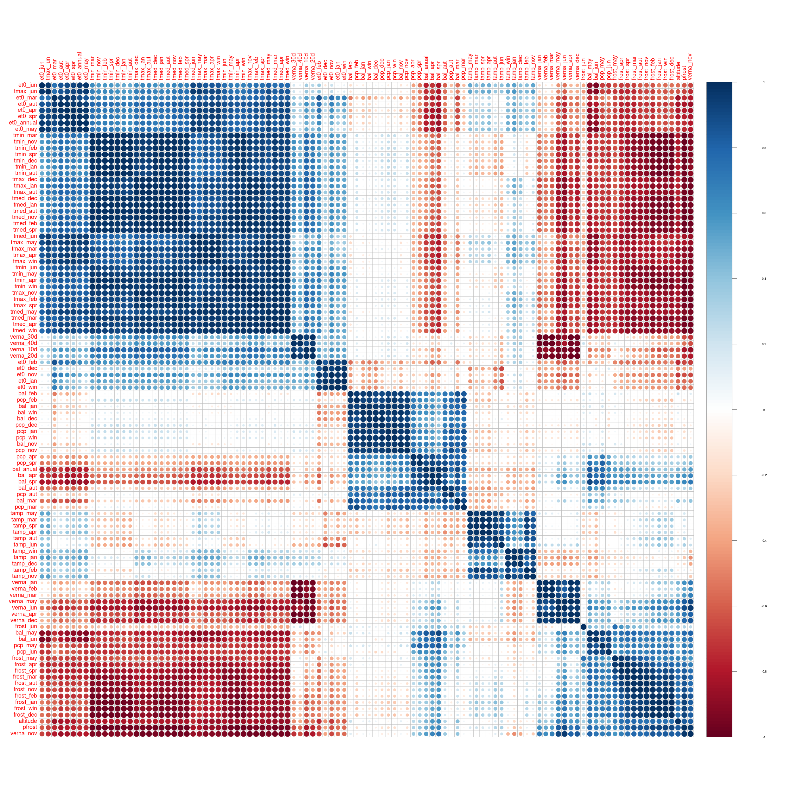
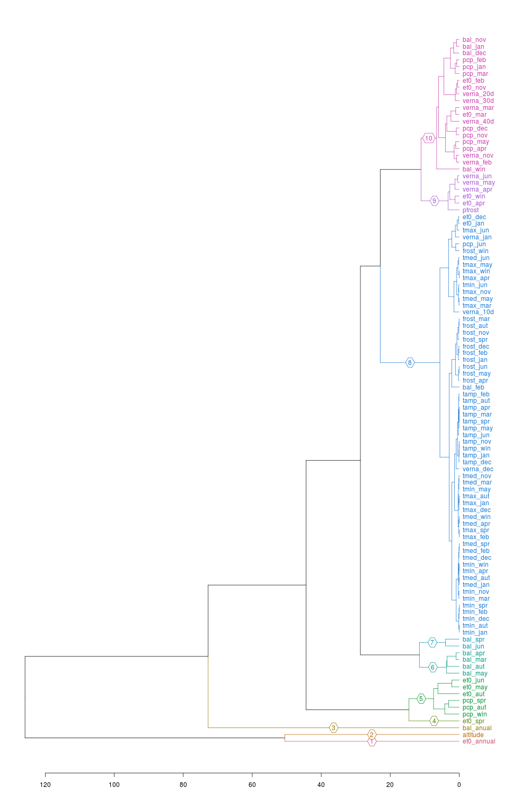

```{r knitr setup, include=FALSE,  eval=TRUE, echo=FALSE, warning=FALSE}
library(knitr)
knitr::opts_chunk$set(eval=TRUE, cache=FALSE, message=FALSE, warning=FALSE, 
                      comment = "", results="markup")
```

This document describes how climate data (1981-2010), compiled by R Serrano and S Beguería, 
and analyzed also by B Contreras Moreira, were processed in order to carry out 
Genome–Environment Association (GEA) in combination with barley SNPs.

-----
# Inspecting the raw data

The original data file was renamed to *barley_climate_updated.tsv*](raw/barley_climate_updated.tsv)
and lines **SBCC142-5 manually commented out**, leaving only mainland, Iberian barleys.
Note that SBCC138 was also left out as suggested by AM Casas due to uncertainty in genotype data. 
In addition, note that line SBCC036 lacks data for variables *et0_spr, bal_aut, bal_win, bal_jun, bal_mar_apr_may*,
and was thus excluded from the climate-complete dataset. The following variables are currently included:

<center>

|var    |full name                                     |
|:------|:---------------------------------------------|
|$\mbox{pcp}$|average cumulative precipitation|
|$\mbox{pcp}_{p10}$|average 10th percentile of cumulative precipitation|
|$\mbox{tmed}$|average daily mean temperature|
|$\mbox{tmax}$|average daily max temperature|
|$\mbox{tmin}$|average daily min temperature|
|$\mbox{tamp}$|average daily thermal amplitude (Celsius)|
|$\mbox{verna}$|average potential vernalization (days)|
|$\mbox{verna}_n$|average number of days since 15th November to reach $n=(10,20,30,40)$ vernalization days|
|$\mbox{frost}$|average number of frost days|
|$\mbox{pfrost}_{01}$|average first day in the year where $p(\mbox{tmin}<0) \leq 0.10$|
|$\mbox{et0}$|average potential evapotranspiration, according to FAO56 Penman-Monteith|
|$\mbox{bal}$|climatic water balance ($\mbox{pcp}$ - $\mbox{et0}$) average potential evapotranspiration, according to FAO56 Penman-Monteith|
|$\mbox{dummy}$|random data with some spatial coherence|

</center>

Altitude/elevation data are stored on file [*SBCC_altitude.tsv*](raw/SBCC_altitude.tsv).

For each variable with the exception of $\mbox{pfrost}_{01}$ monthly, seasonal
and annual averages are given. Monthly values are signaled with subscripts
_01 to _12, while seasonal and annual values are denoted by the subscripts
_spr, _aut, _win and _annual. Summer aggregates and months between July and
October are not expected to have any influence on barley cultivars, hence they
were excluded on further analyses.

Dummy climate variables were simulated as explained in this 
[blog post](http://santiago.begueria.es/2010/10/generating-spatially-correlated-random-fields-with-r)
by S Beguería.

```{r readRawData}
# read raw data (landraces SBCC138,142-5 previously excluded)
rawdata <- read.table(file="raw/barley_climate_updated.tsv", header=TRUE, sep="\t")
 
# read altitude (skipping SBCC138,142-5)
altitude <- read.table(file="raw/SBCC_altitude.tsv",header=T)
rawdata <- merge(rawdata, altitude, by="id")

# fix var names
# #month is replaced by 3-letter string 
# vernalization days are made explicit
climvarnames = colnames(rawdata)

climvarnames = gsub("pfrost_01", "pfrost", climvarnames)
climvarnames = gsub("verna_d_01", "verna_10d", climvarnames)
climvarnames = gsub("verna_d_02", "verna_20d", climvarnames)
climvarnames = gsub("verna_d_03", "verna_30d", climvarnames)
climvarnames = gsub("verna_d_04", "verna_40d", climvarnames)

climvarnames = gsub("dummy_", "dummy", climvarnames)

climvarnames = gsub("_01$", "_jan", climvarnames)
climvarnames = gsub("_02$", "_feb", climvarnames)
climvarnames = gsub("_03$", "_mar", climvarnames)
climvarnames = gsub("_04$", "_apr", climvarnames)
climvarnames = gsub("_05$", "_may", climvarnames)
climvarnames = gsub("_06$", "_jun", climvarnames)
climvarnames = gsub("_07$", "_jul", climvarnames)
climvarnames = gsub("_08$", "_aug", climvarnames)
climvarnames = gsub("_09$", "_sep", climvarnames)
climvarnames = gsub("_10$", "_oct", climvarnames)
climvarnames = gsub("_11$", "_nov", climvarnames)
climvarnames = gsub("_12$", "_dec", climvarnames)

climvarnames = gsub("dummy", "dummy_", climvarnames)

colnames(rawdata) = climvarnames

# exclude months between harvest and planting
# exclude unsed percentile10 vars 
alldummies <- rawdata[,grep("dummy|id",colnames(rawdata),perl=T)] # before removing summer months
w <- grep('sum|jul|aug|sep|oct|_p10_', names(rawdata), perl=TRUE)
rawdata <- rawdata[,-w]

# separate dummy and climate* variables
dummydata <- rawdata[,grep("dummy|id",colnames(rawdata),perl=T)]
geodata <- rawdata[,grep("utmx|utmy|altitude|id",colnames(rawdata),perl=T)]
climdata <- rawdata[,grep("dummy|utm",colnames(rawdata),perl=T,invert=T)]

pcp <- climdata[,grep("pcp",colnames(climdata))]
tmed <- climdata[,grep("tmed",colnames(climdata))]
tmax <- climdata[,grep("tmax",colnames(climdata))]
tmin <- climdata[,grep("tmin",colnames(climdata))]
amp_termica <- climdata[,grep("tamp",colnames(climdata))]
heladas <- climdata[,grep("frost|probab",colnames(climdata))]
vernal <- climdata[,grep("verna",colnames(climdata))]
drought <- climdata[,grep("et0|bal",colnames(climdata))]
```


## Exploratory analysis

The climate data was inspected by calculating correlations 
(see [**sample plot**](./plots/amp_termica.png)) and histograms:

```{r histogramsAndCorrelations}
# example of auto-correlations (both in report and file)
panel.hist <- function(x, ...) {
    usr <- par("usr"); on.exit(par(usr))
    par(usr = c(usr[1:2], 0, 1.5) )
    h <- hist(x, plot=FALSE)
    breaks <- h$breaks; nB <- length(breaks)
    y <- h$counts; y <- y/max(y)
    rect(breaks[-nB], 0, breaks[-1], y, col = "cyan", ...)
}
panel.cor <- function(x, y, digits = 2, prefix = "", cex.cor, ...) {
    usr <- par("usr"); on.exit(par(usr))
    par(usr = c(0, 1, 0, 1))
    r <- abs(cor(x, y, use="pairwise.complete.obs"))
    txt <- format(c(r, 0.123456789), digits = digits)[1]
    txt <- paste0(prefix, txt)
    if(missing(cex.cor)) cex.cor <- 0.8/strwidth(txt)
    text(0.5, 0.5, txt, cex=cex.cor*r)
}
png("plots/amp_termica.png",height=800,width=1000)
aux <- amp_termica
names(aux) <- gsub('amp_termica_','',names(amp_termica))
pairs(aux, panel=panel.smooth, pch=21, cex=0.5, bg='light blue',
      diag.panel=panel.hist, upper.panel=panel.cor,
      cex.labels=1.5, font.labels=2, #cex.cor=1.5, 
      main='Thermal amplitude')
dev.off()

# histograms to check what they look like
par(mfrow=c(5,3), mar=c(3,3,3,2)+0.1)

hist(geodata$utmx,main="longitude (UTM)")
hist(geodata$utmy,main="latitude (UTM)")
hist(geodata$altitude,main="elevation")

hist(pcp$pcp_win,main="pcp_win (Winter)")
hist(pcp$pcp_apr,main="precip. (Apr)")
hist(tmax$tmax_mar,main="tmax_mon (Mar)")

hist(tmin$tmin_win,main="tmin (winter)")
hist(amp_termica$tamp_jan,main="thermal amp. (Jan)")
hist(heladas$frost_feb,main="number frosts (Feb)")

hist(heladas$pfrost, main="prob. frost < 0.10")
hist(vernal$verna_jan, main="vernalization (Jan)")
hist(vernal$verna_10d, main="vernal. 10 days")

hist(drought$et0_spr, main="ETo (spring)")
hist(drought$bal_spr, main="water balance (spring)")
hist(drought$bal_anual, main="water balance (annual)")

dev.off()

# As expected, there is a high covariance in this data set:

library(corrplot)
w <- complete.cases(climdata)
png("plots/climate_correlations.png",height=2500,width=2500)
png("plots/climate_correlations.png",height=2500,width=2500)
corrplot(cor(climdata[w,2:ncol(climdata)]), order="hclust",
         hclust.method="ward.D2", tl.cex=1.5)
dev.off()
```
<!-- 
library(corrgram)
png("plots/climate_correlogram.png",height=5000,width=5000)
  par(mar=c(3,1,1,7))
  corrgram(climdata[w,-1], main='Correlogram (PCA ordered)',
    lower.panel=panel.pts,	upper.panel=panel.conf,
    diag.panel=panel.density, order=TRUE,
    cex.labels=1, font.labels=2)
    col.regions=colorRampPalette(c("darkgoldenrod4", "burlywood1", "darkkhaki", "darkgreen")))
dev.off()
-->



<!-- -->


## Cluster analysis

There is a high level of covariance between the variables in the data set.
Reducing the number of variables to eliminate redundancy would thus be a good
idea. We can use clusters to find groups of variables that could be reduced to
only one representative of the group.

```{r dendrogram}
library(cluster)
library(dendextend)
library(ape)

# distance matrix, no scaling / centering: original variables
#climdists = daisy(t(climdata[,2:ncol(climdata)]), metric="euclidean", stand=FALSE)

# distance matrix, parametric scaling / centering (standardisation)
# climdists = daisy(t(climdata[,2:ncol(climdata)]), metric="euclidean", stand=TRUE)

# distance matrix, non-parametric scaling / centering
#climdists = daisy(scale(t(climdata[,2:ncol(climdata)])), metric="euclidean", stand=FALSE)
climdists = dist(scale(t(climdata[,2:ncol(climdata)])))

climclusters = hclust(climdists, method="ward.D2")
climclusters = color_branches(climclusters, k=10, groupLabels=TRUE)
climclusters = color_labels(climclusters, k=10)

png("plots/climate_clusters.png",height=1500,width=1000)
#  par(mar=c(3,1,1,7), mfrow=c(1,2))
  par(mar=c(3,1,1,7))
  plot(as.dendrogram(climclusters),horiz=TRUE,cex=1)
#  plot(cut(climclusters, h=10)$upper,horiz=TRUE,cex=1)
dev.off()
```


Based on these results, and considering common agronomic knowledge, 
we propose reducing the set of variables to the following
list of 20 that represent all the groups in the dendrogram above.
This reduced list is used for the rest of the analyses.
Some variables are combinations of monthly variables.
For convenience, month numbers were renamed to 3-letter strings,
as well as $\mbox{pfrost}_{01}$ simplified to $\mbox{pfrost}$:

|var    |full name                                     |
|:------|:---------------------------------------------|
|$utmx$|longitude|
|$utmy$|latitude|
|$alt$|altitude|
|$pcp_{aut}$|average autumn precipitation|
|$pcp_{win}$|average winter precipitation|
|$pcp_{mar,apr}$|average precipitation February, March|
|$pcp_{may,jun}$|average precipitation April and May|
|$et_o$|annual potential evapotranspiration|
|$bal$|annual climatic water balance ($\mbox{pcp}$ - $\mbox{et0}$)|
|$et_{o,spr}$|spring potential evapotranspiration|
|$bal_{aut}$|autumn climatic water balance ($\mbox{pcp}$ - $\mbox{et0}$)|
|$bal_{winter}$|winter climatic water balance ($\mbox{pcp}$ - $\mbox{et0}$)|
|$bal_{mar,apr,may}$|climatic water balance, March, April and May|
|$bal_{jun}$|annual climatic water balance, June|
|$tamp_{win}$|average daily thermal amplitude in winter|
|$tamp_{spr}$|average daily thermal amplitude in spring|
|$verna_{30d}$|average number of days since January 1st to reach 30 potential vernalization days|
|$verna_{jan,feb}$|average vernalization days in January and February|
|$verna_{mar,apr}$|average vernalization days in March and April|
|$frost_{jan,feb}$|average number of frost days in January and February|
|$frost_{apr,may}$|average number of frost days in April and May|
|$pfrost$|average first day in the year where $p(tmin<0) \leq 0.10$|


## PCA analysis

Another way to reduce the dimensionality of the data while keeping most of
its variance is to build new variates based on linear combinations of the
variables. We can do this with a Principal Component Analysis (PCA), 
which first requires removing incomplete/missing data:

```{r}
w <- complete.cases(climdata) 
incomplete = climdata[ !w, ]$id              # SBCC036 is left out due to missing data
incomplete 

pca <- prcomp(climdata[w,-1], center=TRUE, scale=TRUE)

summary(pca)

barplot(pca$sdev[1:10]^2, main='Variance explained (first 10 components)')
abline(h=1, col='red')
```

Note that the first six components explain more than 96% of the original variance.

By inspecting the eigenvectors we can assess the relationship between PCs and
the original variables:

```{r, fig.height=10, fig.width=8}
# pca$rotation[,1:6]

par(mar=c(5,10,4,2)+0.1)
barplot(sort(pca$rotation[,1]), space=0, main='Comp. 1', col='red',
    horiz=TRUE, cex.names=0.75, las=1)
barplot(sort(pca$rotation[,2]), main='Comp. 2', col='red',
    horiz=TRUE, cex.names=0.75, las=1)
barplot(sort(pca$rotation[,3]), main='Comp. 3', col='red',
    horiz=TRUE, cex.names=0.75, las=1)
barplot(sort(pca$rotation[,4]), main='Comp. 4', col='red',
    horiz=TRUE, cex.names=0.75, las=1)
barplot(sort(pca$rotation[,5]), main='Comp. 5', col='red',
    horiz=TRUE, cex.names=0.75, las=1)
barplot(sort(pca$rotation[,6]), main='Comp. 6', col='red',
    horiz=TRUE, cex.names=0.75, las=1)

#biplot(pca)
#biplot(pca, choices=3:4)
#biplot(pca, choices=5:6)
```

The scores indicate the values of each observation on the components (it is
a matrix of the rotated data).

```{r}
library(knitr)
scores <- pca$x
kable(data.frame(id=climdata[w,1], scores)[1:3,1:10], digits=4)
write.table(scores ,sep='\t', row.names=FALSE, quote=FALSE,
            file='./raw/barley_climate_pca_scores.tsv')

# write up to the sixth PC for bayenv2 analysis
normPCscores = scale(scores[,1:6])
write.table(t(normPCscores),file="SBCC_PC_environfile.tsv",sep="\t",
              row.names=F,col.names=F,quote=F)

# and for LFMM
write.table(normPCscores,file="SBCC_PC_environfile.tr.tsv",sep="\t",
              row.names=F,col.names=F,quote=F)
  
# save order of samples/populations used for PCA
write.table(climdata[w,1],file="SBCC_PC_order.txt",col.names=F,row.names=F,quote=F)

# print names of PC vars as they appear in the TSV file
write.table(rownames(t(normPCscores)),
              file="SBCC_PC_environfile_order.txt",
              row.names=F,col.names=F,quote=F)

# print names of dummy environmental vars as they appear in the TSV file
write.table(rownames(t(alldummies))[-1],
              file="SBCC_dummy_environfile_order.txt",
              row.names=F,col.names=F,quote=F)
```

The rotation matrix gives the variable loadings (it is a matrix of
eigenvectors).

```{r}
eigenvec <- pca$rotation
kable(eigenvec[1:6,1:10], digits=4)
write.table(eigenvec, sep='\t' , row.names=FALSE, quote=FALSE,
            file='./raw/barley_climate_pca_eigenvectors.tsv')
```

It is easy to obtain the PCA scores from the data and eigenvectors, for
instance if we want to produce maps of the components.
Note that we need to center and scale the original data:

```{r}
scal <- cbind(pca$scale, pca$center)
colnames(scal) <-  c('scale', 'center')
kable(head(scal), digits=3)
write.table(scal, sep='\t', row.names=TRUE, quote=FALSE,
            file='./raw/barley_climate_scaling.tsv')

# scores
kable(scores[1:3,1:3], digits=3)

# scores = data %*% eigenvectors
# with automatic scaling and centering
data <- scale(climdata[w,-1], center=TRUE, scale=TRUE)
kable((data %*% eigenvec)[1:3,1:3], digits=3)

# with manual scaling and centering
# (new = (ori-center) / scale)
data <- sweep(sweep(climdata[w,-1], 2, scal[,'center'], '-'), 2, scal[,'scale'], '/')
data <- as.matrix(data)
kable((data %*% eigenvec)[1:3,1:3], digits=3)
```


# Producing ENVIRONFILE files

In order to use [bayenv2](https://gcbias.org/bayenv) and 
[LFMM](http://membres-timc.imag.fr/Olivier.Francois/lfmm) 
we need to build **ENVIRONFILE** files where each line is an environmental variable across populations, with tab-separated values and standardized after subtracting the mean and dividing by the standard deviation across populations. The variables should be listed in the same population order as they appear in the allele count files. 

After the previous analyses a few raw and linearly-combined variables were short-listed. However, some of the raw variables are two-month summaries, which we still need to compute:

```{r createSBCC_environfile}

  # save order of samples/populations
  write.table(climdata[,1],file="SBCC_order.txt",col.names=F,row.names=F,quote=F)
  write.table(climdata[w,1],file="SBCC_order_complete_env.txt",col.names=F,row.names=F,quote=F)
  
  # control vars: dummy, lat, long, alt
  nrclimdata = geodata
  alldummydata = geodata
  
  alldummydata = merge( alldummydata, alldummies, by="id")
  alldummydata = alldummydata[,grep("dummy|id",colnames(alldummydata),perl=T)] 
              
  nrclimdata = merge( nrclimdata, 
                      dummydata[,grep("dummy_01|id",colnames(dummydata),perl=T)], 
                      by="id")
  
  # merge selected climate vars (in the order of the list above)
  
  # verna_30days
  nrclimdata = merge( nrclimdata, 
                      rawdata[,grep("verna_30d|id",colnames(rawdata),perl=T)], 
                      by="id")
  
  # verna_med_10_20
  verna_avg_10_20 = rowMeans(subset(rawdata,select=c("verna_10d","verna_20d")))
  nrclimdata = merge( nrclimdata, data.frame(id=rawdata[,1],verna_avg_10_20),by="id")
  
  # verna_med_30_40
  verna_avg_30_40 = rowMeans(subset(rawdata,select=c("verna_30d","verna_40d")))
  nrclimdata = merge( nrclimdata, data.frame(id=rawdata[,1],verna_avg_30_40),by="id")
  
  # pfrost_01
  nrclimdata = merge( nrclimdata, 
                      rawdata[,grep("pfrost|id",colnames(rawdata),perl=T)], 
                      by="id")
  
  # pcp_aut
  nrclimdata = merge( nrclimdata, 
                      rawdata[,grep("pcp_aut|id",colnames(rawdata),perl=T)], 
                      by="id")
  
  # pcp_win
  nrclimdata = merge( nrclimdata, 
                      rawdata[,grep("pcp_win|id",colnames(rawdata),perl=T)], 
                      by="id")
  
  # pcp_03_04 (*)
  pcp_03_04 = rowSums(subset(rawdata,select=c("pcp_mar","pcp_apr")))
  nrclimdata = merge( nrclimdata, data.frame(id=rawdata[,1],pcp_03_04),by="id")
  
  # pcp_05_06 (*)
  pcp_05_06 = rowSums(subset(rawdata,select=c("pcp_may","pcp_jun")))
  nrclimdata = merge( nrclimdata, data.frame(id=rawdata[,1],pcp_05_06),by="id")
  
  # heladas_01_02 (*)
  frosts_01_02 = rowSums(subset(rawdata,select=c("frost_jan","frost_feb")))
  nrclimdata = merge( nrclimdata, data.frame(id=rawdata[,1],frosts_01_02),by="id")
  
  # heladas_04_05 (*)
  frosts_04_05 = rowSums(subset(rawdata,select=c("frost_apr","frost_may")))
  nrclimdata = merge( nrclimdata, data.frame(id=rawdata[,1],frosts_04_05),by="id")
  
  # amp_termica_win
  nrclimdata = merge( nrclimdata, 
                      rawdata[,grep("tamp_win|id",colnames(rawdata),perl=T)], 
                      by="id")
  
  # amp_termica_spr
  nrclimdata = merge( nrclimdata, 
                      rawdata[,grep("tamp_spr|id",colnames(rawdata),perl=T)], 
                      by="id")
  
  # et0_spr
  nrclimdata = merge( nrclimdata, 
                      rawdata[,grep("et0_spr|id",colnames(rawdata),perl=T)], 
                      by="id")
  # bal_aut
  nrclimdata = merge( nrclimdata, 
                      rawdata[,grep("bal_aut|id",colnames(rawdata),perl=T)], 
                      by="id")
  
  # bal_win
  nrclimdata = merge( nrclimdata, 
                      rawdata[,grep("bal_win|id",colnames(rawdata),perl=T)], 
                      by="id")
  
  # bal_06
  nrclimdata = merge( nrclimdata, 
                      rawdata[,grep("bal_jun|id",colnames(rawdata),perl=T)], 
                      by="id")
  
  # bal_mar,apr,may
  bal_03_04_05 = rowSums(subset(rawdata,select=c("bal_mar","bal_apr","bal_may")))
  nrclimdata = merge( nrclimdata, data.frame(id=rawdata[,1],bal_03_04_05),by="id")
  
  # set full variable names
  colnames(nrclimdata) = c(
    'id','lon','lat','alt','dummy',
    'verna_30d','verna_jan_feb','verna_mar_apr',
    'pfrost',
    'pcp_aut','pcp_win','pcp_mar_apr','pcp_may_jun',
    'frost_jan_feb','frost_apr_may',
    'tamp_win','tamp_spr',
    'et0_spr',
    'bal_aut','bal_win','bal_jun','bal_mar_apr_may' 
    )
  
  # standardize columns including UTC coordinates
  normdummydata = scale(alldummydata[,2:ncol(alldummydata)])
  normdata = scale(nrclimdata[,2:ncol(nrclimdata)])
  
  # print climate vars
  
  # for bayenv2
  write.table(t(normdummydata),file="SBCC_dummy_environfile.tsv",sep="\t",
              row.names=F,col.names=F,quote=F)
  
  write.table(t(normdata),file="SBCC_environfile.tsv",sep="\t",
              row.names=F,col.names=F,quote=F)
  
  # for LFMM
  write.table(normdata,file="SBCC_environfile.tr.tsv",sep="\t",
              row.names=F,col.names=F,quote=F)
  
  # print names of climate vars as they appear in the TSV file
  write.table(rownames(t(nrclimdata[,2:ncol(nrclimdata)])),
              file="SBCC_environfile_order.txt",
              row.names=F,col.names=F,quote=F)
```

Three files are generated: [*SBCC_order.txt*](./SBCC_order.txt),  [*SBCC_environfile_order.txt*](./SBCC_environfile_order.txt) and [*SBCC_environfile.tsv*](./SBCC_environfile.tsv)


# Saving climatologies on grids

We shall store grids of the selected 21 variables over the relevant map (Spain in this work) 
into a single R object, which we can use later for representation purposes.
These are 5x5 km rasters (grids), stored in a single RasterBrick.

```{r createClimatologiesFile}
if (!file.exists('./maps/climatologies_5km.RData')) {

  library(maptools)
  library(raster)

  # read previously computed individual raster asc files
  # these are not provided in GitHub, only the .RData file is given
  clima <- raster(read.asciigrid('./maps/altitude.asc.gz'))
  lat <- lon <- clima
  xy <- coordinates(clima)
  lon[] <- xy[, 1]
  lon <- lon*clima/clima
  lat[] <- xy[, 2]
  lat <- lat*clima/clima
  clima <- brick(lon, lat, clima)
  names(clima) <- c('lon', 'lat', 'alt')

  newclima <- raster(read.asciigrid('./maps/pcp_aut.asc.gz'), layer=1)
  names(newclima) <- 'pcp_aut'
  newclima2 <- raster(read.asciigrid('./maps/pcp_win.asc.gz'), layer=1)
  names(newclima2) <- 'pcp_win'
  clima <- addLayer(clima, newclima, newclima2)

  newclima <- raster(read.asciigrid('./maps/pcp_03.asc.gz'), layer=1)
  newclima2 <- raster(read.asciigrid('./maps/pcp_04.asc.gz'), layer=1)
  newclima[,3] <- newclima[,3] + newclima2[,3]
  names(newclima) <- 'pcp_mar_apr'
  clima <- addLayer(clima, newclima)

  newclima <- raster(read.asciigrid('./maps/pcp_05.asc.gz'), layer=1)
  newclima2 <- raster(read.asciigrid('./maps/pcp_06.asc.gz'), layer=1)
  newclima[,3] <- newclima[,3] + newclima2[,3]
  names(newclima) <- 'pcp_may_jun'
  clima <- addLayer(clima, newclima)

  newclima <- raster(read.asciigrid('./maps/et0_annual.asc.gz'), layer=1)
  names(newclima) <- 'et0'
  newclima2 <- raster(read.asciigrid('./maps/et0_spr.asc.gz'), layer=1)
  names(newclima2) <- 'et0_spr'
  clima <- addLayer(clima, newclima, newclima2)

  newclima <- raster(read.asciigrid('./maps/bal_aut.asc.gz'), layer=1)
  names(newclima) <- 'bal_aut'
  newclima2 <- raster(read.asciigrid('./maps/bal_win.asc.gz'), layer=1)
  names(newclima2) <- 'bal_win'
  clima <- addLayer(clima, newclima, newclima2)

  newclima <- raster(read.asciigrid('./maps/bal_03.asc.gz'), layer=1)
  newclima2 <- raster(read.asciigrid('./maps/bal_04.asc.gz'), layer=1)
  newclima3 <- raster(read.asciigrid('./maps/bal_05.asc.gz'), layer=1)
  newclima[,3] <- newclima[,3] + newclima2[,3] + newclima3[,4]
  names(newclima) <- 'bal_mar_apr_may'
  clima <- addLayer(clima, newclima)

  newclima <- raster(read.asciigrid('./maps/bal_06.asc.gz'), layer=1)
  names(newclima) <- 'bal_jun'
  clima <- addLayer(clima, newclima)

  newclima <- raster(read.asciigrid('./maps/tamp_win.asc.gz'), layer=1)
  names(newclima) <- 'tamp_win'
  newclima2 <- raster(read.asciigrid('./maps/tamp_spr.asc.gz'), layer=1)
  names(newclima2) <- 'tamp_spr'
  clima <- addLayer(clima, newclima, newclima2)

  newclima <- raster(read.asciigrid('./maps/verna_30d.asc.gz'), layer=1)
  names(newclima) <- 'verna_30d'
  clima <- addLayer(clima, newclima)
  
  newclima <- raster(read.asciigrid('./maps/verna_01.asc.gz'), layer=1)
  newclima2 <- raster(read.asciigrid('./maps/verna_02.asc.gz'), layer=1)
  newclima[,3] <- newclima[,3] + newclima2[,3]
  names(newclima) <- 'verna_jan_feb'
  clima <- addLayer(clima, newclima)

  newclima <- raster(read.asciigrid('./maps/verna_03.asc.gz'), layer=1)
  newclima2 <- raster(read.asciigrid('./maps/verna_04.asc.gz'), layer=1)
  newclima[,3] <- newclima[,3] + newclima2[,3]
  names(newclima) <- 'verna_mar_apr'
  clima <- addLayer(clima, newclima)

  newclima <- raster(read.asciigrid('./maps/frost_01.asc.gz'), layer=1)
  newclima2 <- raster(read.asciigrid('./maps/frost_02.asc.gz'), layer=1)
  newclima[,3] <- newclima[,3] + newclima2[,3]
  names(newclima) <- 'frost_jan_feb'
  clima <- addLayer(clima, newclima)
    
  newclima <- raster(read.asciigrid('./maps/frost_04.asc.gz'), layer=1)
  newclima2 <- raster(read.asciigrid('./maps/frost_05.asc.gz'), layer=1)
  newclima[,3] <- newclima[,3] + newclima2[,3]
  names(newclima) <- 'frost_apr_may'
  clima <- addLayer(clima, newclima)

  newclima <- raster(read.asciigrid('./maps/pfrost.asc.gz'))
  names(newclima) <- 'pfrost'
  clima <- addLayer(clima, newclima)

  newclima <- raster(read.asciigrid('./maps/dummy_01.asc.gz'))
  names(newclima) <- 'dummy_01'
  clima <- addLayer(clima, newclima)
  
  newclima <- raster(read.asciigrid('./maps/dummy_02.asc.gz'))
  names(newclima) <- 'dummy_02'
  clima <- addLayer(clima, newclima)

  newclima <- raster(read.asciigrid('./maps/dummy_03.asc.gz'))
  names(newclima) <- 'dummy_03'
  clima <- addLayer(clima, newclima)

  newclima <- raster(read.asciigrid('./maps/dummy_04.asc.gz'))
  names(newclima) <- 'dummy_04'
  clima <- addLayer(clima, newclima)

  newclima <- raster(read.asciigrid('./maps/dummy_05.asc.gz'))
  names(newclima) <- 'dummy_05'
  clima <- addLayer(clima, newclima)

  newclima <- raster(read.asciigrid('./maps/dummy_06.asc.gz'))
  names(newclima) <- 'dummy_06'
  clima <- addLayer(clima, newclima)

  newclima <- raster(read.asciigrid('./maps/dummy_07.asc.gz'))
  names(newclima) <- 'dummy_07'
  clima <- addLayer(clima, newclima)

  newclima <- raster(read.asciigrid('./maps/dummy_08.asc.gz'))
  names(newclima) <- 'dummy_08'
  clima <- addLayer(clima, newclima)

  newclima <- raster(read.asciigrid('./maps/dummy_09.asc.gz'))
  names(newclima) <- 'dummy_09'
  clima <- addLayer(clima, newclima)

  newclima <- raster(read.asciigrid('./maps/dummy_10.asc.gz'))
  names(newclima) <- 'dummy_10'
  clima <- addLayer(clima, newclima)

  newclima <- raster(read.asciigrid('./maps/dummy_11.asc.gz'))
  names(newclima) <- 'dummy_11'
  clima <- addLayer(clima, newclima)

  newclima <- raster(read.asciigrid('./maps/dummy_12.asc.gz'))
  names(newclima) <- 'dummy_12'
  clima <- addLayer(clima, newclima)

  # save it
  save(clima, file='./maps/climatologies_5km.RData')
}
```

This generates file *./maps/climatologies_5km.RData*

We can also calculate grids of the first six components of the PCA above.

```{r createPCAmaps, fig.height=12, fig.width=12}
if (!file.exists('./maps/climatologies_5km_pca.RData')) {
  
  # read the scaling and PCA matrices
  scal <- read.table('./raw/barley_climate_scaling.tsv')
  eigenvec <- as.matrix(
                read.table('./raw/barley_climate_pca_eigenvectors.tsv',
                             header=TRUE))

  # load the maps of all the (104) variables in the PCA
  nam <- rownames(scal)
  
  nam = gsub("_jan$", "_01", nam)
  nam = gsub("_feb$", "_02", nam)
  nam = gsub("_mar$", "_03", nam)
  nam = gsub("_apr$", "_04", nam)
  nam = gsub("_may$", "_05", nam)
  nam = gsub("_jun$", "_06", nam)
  nam = gsub("_nov$", "_11", nam)
  nam = gsub("_dec$", "_12", nam)

  pcaclima <- raster(read.asciigrid(paste('./maps/',nam[1], '.asc.gz', sep='')))
  for (n in 2:length(nam)) {
    newdata <- raster(read.asciigrid(paste('./maps/',nam[n], '.asc.gz', sep='')),
                      layer=1)
    pcaclima <- addLayer(pcaclima, newdata)
  }
  names(pcaclima) <- nam
  plot(pcaclima)

  # center and scale climate data
  tmpdata <- sweep(sweep(as.data.frame(pcaclima), 2, scal[,'center'], '-'),
                2, scal[,'scale'], '/')
  pcaclima <- setValues(pcaclima, as.matrix(tmpdata))

  # multiply by eigenvector matrix
  pcaclima <- setValues(pcaclima, as.matrix(pcaclima) %*% eigenvec)
  plot(pcaclima)
  
  # save it
  save(pcaclima, file='./maps/climatologies_5km_pca.RData')
}
```

The results are stored on file *./maps/climatologies_5km_pca.RData*


-----

# Mapping

`snpmap` is a function to jointly map a SNP and a climatology. Note that it
requires some extra packages to be loaded. It can be loaded from local file
[*./mapping.R*](./mapping.R), which requires package **ggplot2**. 
Below there are some examples.
We start by loading the grid data, 

```{r mappingExampleLoadData}
source('./mapping.R')

# load full SNP table
snps <- read.table('./raw/9920_SNPs_SBCC_50K.tsv', header=TRUE, sep='\t')
snps <- t(snps)
snps <- cbind(row.names(snps), snps)
colnames(snps) <- snps[1,]
snps <- snps[-1,]
coll_points <- read.table(file='./raw/barley_climate_updated.tsv',
                     header=TRUE, sep='\t')[,c(1:3)]
snps <- merge(coll_points, snps, by.x='id', by.y='marker')
snps[1:10,c(1:4,ncol(snps))]

# exclude barleys from the Canary and Balearic Islands
#can <- which(snps$utmy<4000000)
#bal <- which(snps$utmx>1030000)
#snps <- snps[-c(can, bal),]

# load climatologies (a data.frame named 'clima')
load('./maps/climatologies_5km.RData')

# load PCA climatologies (a data.frame named 'clima')
load('./maps/climatologies_5km_pca.RData')

# load a shape (border) of Spain (a data.frame named 'esp')
load('./maps/Spain_border.RData')
```

To produce a map showing the geographical distribution of the samples, 
with no extra information:

```{r mappingExampleSnpOnly2}
snpmap(snps, border=esp, size=3)
```

To produce a map showing the geographical distribution of a single SNP:

```{r mappingExampleSnpOnly}
snpmap(snps, '3255833|F|0', border=esp, size=3)
```

To produce a map of one climatic variable, with no border:

```{r mappingExampleClimatologyOnly}
names(clima)
snpmap(clim=clima, climname='pfrost')
```

To produce a complete map showing the distribution of one SNP on top of a
climatology, with the border:

```{r mappingExampleSnipAndClimatology}
snpmap(snps, 'BOPA2_12_30894', clima, 'pfrost', esp, size=3)
```
Now, the same with on top of a PCA component:

```{r mappingExampleSnipAndPCA}
snpmap(snps, 'BOPA2_12_10979', pcaclima, 'PC1', esp, size=3)
```

And on a dummy variable:

```{r mappingExampleSnipAndPCADum}
snpmap(snps, 'BOPA2_12_10979', clima, 'dummy_01', esp, size=3)
```


The function `snpmap` returns a ggplot object. This object can be stored, and
then modified using standard `ggplot2` functions, for instance to override
the default plotting options. Note that this may issue a warning:

```{r mappingExampleModifyMap}
g <- snpmap(snps, 'BOPA2_12_30894', clima, 'pfrost', esp, size=3)
g + scale_fill_distiller(palette='YlGnBu', name='pfrost')
```

Additionally, the function `snpreg` has been created for plotting a Binomial GLM
(logistic regression) as a means to graphically show the discriminating power
of the explanatory variable. By default, the most frequent alele is compared
with all the other aleles.

```{r plottingRegressionModel, fig.height=4, fig.width=4}
snpreg(snps, 'BOPA2_12_10979', clima, 'verna_30d')
```

```{r createMaps, eval=FALSE, fig.height=4, fig.width=4, include=FALSE}
for (i in 1:dim(clima)[3]) {
  nam <- names(clima)[i]
  g <- snpmap(clim=clima, climname=nam, border=esp)
  ggsave(paste('./maps/plots/',nam,'.png',sep=''), g, width=4, height=2.75, units='in')
}
```
