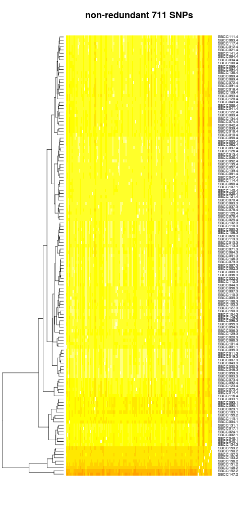
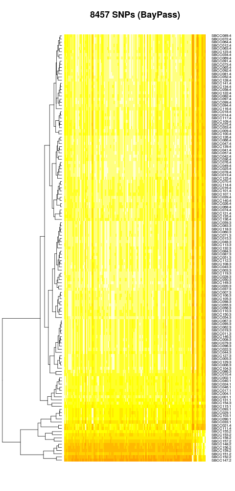
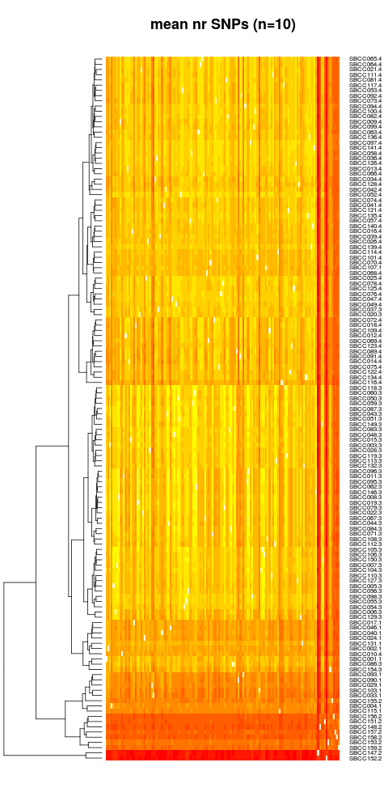
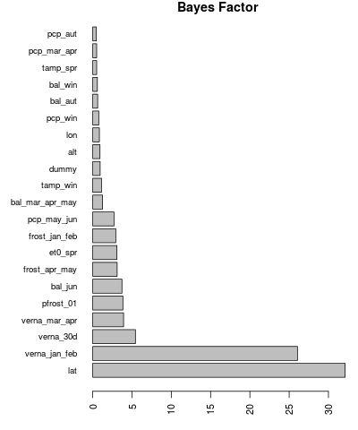
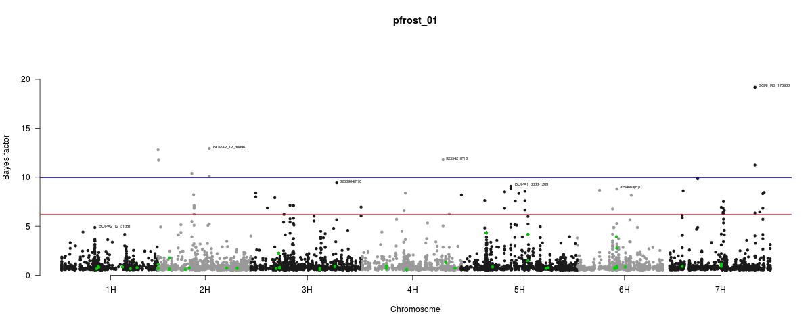

```{r knitr setup, include=FALSE,  eval=TRUE, echo=FALSE, warning=FALSE}
library(knitr)
knitr::opts_chunk$set(eval=TRUE, cache=FALSE, message=FALSE, warning=FALSE, 
                      comment = "", results="markup")
```

This document describes how SNP genotypes from 135 landraces of the Spanish Barley Core Collection (SBCC, produced by AM Casas, E Igartua, B Contreras-Moreira and CP Cantalapiedra) were checked and processed for further use with [bayenv2](https://gcbias.org/bayenv) in combination with climate data.

In the next steps we convert SNPs of SBCC barleys to fit the appropriate formats for downstream analyses. SNPs conserve sample order of climate data. 

First, we shall write a **SNPSFILE** containing allele counts across populations/barleys, where each SNP is represented by two lines in the file, with the counts of allele 1 on the first line and the counts for allele 2 on the second, and so on. The counts of allele 1 and allele 2 are assumed to sum to the sample size typed at this SNP in this population (i.e. the total sample size excluding missing data). 

**NOTE**: although not used in this work, presence-absence (PAV) markers can be converted to SNP-like markers.

Second, SNPs will be used to compute a **covariance matrix** which captures the background similarity between landraces. 

Note: the latest qqman R package was installed as follows:
```{r, engine='bash', eval=FALSE}
library(devtools)
install_github("stephenturner/qqman")
```

## Formatting SNPs

We wrote a Perl script, [*SNP2bayenv.pl*](./SNP2bayenv.pl), to carry out this task. 
The initial set of 9,920 Infinium and GBS markers in file [*9920_SNPs_SBCC_50K.tsv*](raw/9920_SNPs_SBCC_50K.tsv), was converted as follows, accepting up to 10% missing data per position and accepting only biallelic loci (n=8457):
```{r, engine='bash', highlight=TRUE}
./SNP2bayenv.pl raw/9920_SNPs_SBCC_50K.tsv SBCC_order.txt \
  SBCC_9K_SNPs.tsv 2> SBCC_9K_SNPs.log 
head SBCC_9K_SNPs.log 
echo ...
tail SBCC_9K_SNPs.log
```

The resulting [*SBCC_9K_SNPs.tsv*](./SBCC_9K_SNPs.tsv) file is the **SNPSFILE** required by bayenv2. Note that file [*SBCC_9K_SNPs.annot.tsv*](./SBCC_9K_SNPs.annot.tsv) with matching fullnames of SNPs is produced alongside.

A similar file can be produced excluding SBCC entries with missing agroclimatic data, 
which will be used when looking for associations with agroclimatic PCAs:

```{r, engine='bash', highlight=TRUE}
./SNP2bayenv.pl raw/9920_SNPs_SBCC_50K.tsv SBCC_order_complete_env.txt \
  SBCC_9K_SNPs.complete.tsv 2> SBCC_9K_SNPs.complete.log 
```

## Obtaining a covariance matrix

As mentioned earlier, we need to estimate a covariance matrix. This should be done using a large number of markers with little linkage disequilibrium (LD) between them. These SNPs should be well matched in ascertainment scheme to those that will be tested.

Note that computing such a matrix takes a time approximately linear in the number of SNPs used, and can only use a single CPU. If you are analyzing a very large data set you will probably want to estimate the matrix for a randomly chosen subset of the data. For instance, the following command computes a matrix based on all 9K Infinium/GBS markers:

```{r, engine='bash', eval=FALSE}
time ./soft/bayenv2/bayenv2 -i SBCC_9K_SNPs.tsv -p 135 \
  -k 100000 -r 12345 > SBCCmatrix_it100K.out
  
# this command can take a long time:
# real  1955m39.681s
# user  3236m49.676s
# sys   164m29.032s
```

## Obtaining covariance matrices from non-redundant, representative SNPs

Instead of using all markers to build the matrix, which is computationally expensive, we can derive it from a set of non-redundant markers that faithfully capture the diversity and the population structure. 

For instance, it should be possible to select Infinium/GBS markers with limited linkage disequilibrium ($LD<0.2$, computed on a window of 5 neighbors at each side) and unique positions ($cM$) in the Morex physical map. Such a subset of markers, listed in file [*SBCC_rsq0.2_uniqcM.list*](raw/SBCC_rsq0.2_uniqcM.list), can be formatted and passed to bayenv as follows, yielding 711 markers:

```{r, engine='bash'}
./SNP2bayenv.pl raw/9920_SNPs_SBCC_50K.tsv SBCC_order.txt \
  SBCC_nr_SNPs.tsv raw/SBCC_rsq0.2_uniqcM.list \
  2> SBCC_nr_SNPs.log 
  
./SNP2bayenv.pl raw/9920_SNPs_SBCC_50K.tsv SBCC_order_complete_env.txt \
  SBCC_nr_SNPs.complete.tsv raw/SBCC_rsq0.2_uniqcM.list \
  2> SBCC_nr_SNPs.complete.log 
  
head SBCC_nr_SNPs.log 
echo ...
tail SBCC_nr_SNPs.log
```

We will now compute a covariance matrix from these SNPs:

```{r, engine='bash', eval=FALSE}
./soft/bayenv2/bayenv2 -i SBCC_nr_SNPs.tsv -p 135 \
  -k 100000 -r 56789 > SBCCmatrix_nr.out
gzip SBCCmatrix_nr.out
mv SBCCmatrix_nr.out.gz matrices/raw
```

After job completion we can extract the (last iteration) covariance matrix as follows, producing file [*SBCCmatrix_nr.txt*](matrices/SBCCmatrix_nr.txt): 

```{r, engine='bash'}
zcat matrices/raw/SBCCmatrix_nr.out.gz | \
  perl -lne 'if(/ITER = 100000/){$ok=1}elsif($ok){ print }' \
  > matrices/SBCCmatrix_nr.txt
```
Finally, let us check whether covarying barleys actually belong to the same subpopulations inferred by STRUCTURE and BayPass:

```{r}
library(corrplot)
library(gplots)

# read cov matrices and convert them to correlation matrices
mat_nr = as.matrix( read.table(file="matrices/SBCCmatrix_nr.txt", 
                               header=F) )
mat_nr = cov2cor(mat_nr)
mat_BP = as.matrix( read.table(file="BayPass/SBCC_9K_BayPass_mat_omega.out", 
                               header=F) )
mat_BP = cov2cor(mat_BP)

# get full names of landraces
SBCCnames = read.table(file="SBCC_order.txt", header=F)
colnames(SBCCnames) = c("id")

# get Structure kinship cluster of landraces
SBCCk = read.table(file="raw/SBCC_Kinship.full.tsv", header=T,sep="\t")

# merge them and assign names to columns and rows
SBCC = merge( SBCCnames, SBCCk, by="id")
SBCC$kstruct = with(SBCC, paste0(id, '.', structure_cluster))
row.names(mat_nr) = SBCC$kstruct
colnames(mat_nr) = SBCC$kstruct
row.names(mat_BP) = SBCC$kstruct
colnames(mat_BP) = SBCC$kstruct

corrplot(mat_nr,is.corr=T,tl.cex=0.35,order="hclust",title="non-redundant 711 SNPs")

png(file="matrices/SBCCmatrix_nr.tree.png",height=1000)
heatmap.2(mat_nr,scale="none",symm=T,dendrogram="row",trace="none",Colv=F,labCol="",
          cexRow=0.80,key=F,lhei = c(1.5,20),main="non-redundant 711 SNPs")
dev.off()

corrplot(mat_BP,is.corr=T,tl.cex=0.35,order="hclust",title="8457 SNPs (BayPass)")

png(file="matrices/SBCCmatrix_BP.tree.png",height=1000)
heatmap.2(mat_BP,scale="none",symm=T,dendrogram="row",trace="none",Colv=F,labCol="",
          cexRow=0.80,key=F,lhei = c(1.5,20),main="8457 SNPs (BayPass)")
dev.off()
```
In both cases it can be seen that two-rowed barleys are grouped clearly separated from the rest (2), and the remaining clades are pretty homogeneous in terms of kinship, as neighbors most often bear the same STRUCTURE-derived subpopulation number:



  
## Obtaining a robust non-redundant covariance matrix with replicates

We can compute 10 different covariance matrices, which should be more robust to insufficient sampling than a single one:
```{r, engine='bash', eval=FALSE}
for i in {1..10}; do
  rnd=$(perl -e 'printf("%05d",rand(99999))'); echo $rnd; \
  mkdir _job$i; cd _job$i; ln -s ../SBCC_nr_SNPs.tsv .; \
  ./soft/bayenv2/bayenv2 -i SBCC_nr_SNPs.tsv -p 135 -k 100000 -r $rnd \
    > ../SBCCmatrix_nr_it100K_$i.out& 
  cd ..;
done

for i in {1..10}; do
  rnd=$(perl -e 'printf("%05d",rand(99999))'); echo $rnd; \
  mkdir _job$i; cd _job$i; ln -s ../SBCC_nr_SNPs.complete.tsv .; \
  ./soft/bayenv2/bayenv2 -i SBCC_nr_SNPs.complete.tsv -p 134 -k 100000 -r $rnd \
    > ../SBCCmatrix_nr_complete_it100K_$i.out& 
  cd ..;
done
```
It might be good idea to record the seed numbers:
```{r, engine='bash', eval=FALSE}
36316
32629
26876
33723
77153
80588
26815
53741
51846
16928

25062
64988
28231
63981
56136
32912
37991
99418
85387
94303
```
We can now put the resulting files away:
```{r, engine='bash', eval=FALSE}
rm -rf _job*
gzip SBCCmatrix_nr_it100K_* SBCCmatrix_nr_complete_it100K_* 
mv SBCCmatrix_nr_it100K_* SBCCmatrix_nr_complete_it100K_* matrices/raw/
```

We can now extract the final matrices of all 10 Monte Carlo simulations:
```{r, engine='bash', eval=FALSE}
for i in {1..10}; do 
  zcat matrices/raw/SBCCmatrix_nr_it100K_$i.out.gz | \
  perl -lne 'if(/ITER = 100000/){$ok=1}elsif($ok){ print }' \
  > matrices/SBCCmatrix_nr_$i.txt
done

for i in {1..10}; do 
  zcat matrices/raw/SBCCmatrix_nr_complete_it100K_$i.out.gz | \
  perl -lne 'if(/ITER = 100000/){$ok=1}elsif($ok){ print }' \
  > matrices/SBCCmatrix_nr_complete_$i.txt
done
```

Finally, we can now calculate the average covariance matrix:

```{r}
# read all final matrices
m1 = as.matrix( read.table(file="matrices/SBCCmatrix_nr_1.txt", header=F) )
m2 = as.matrix( read.table(file="matrices/SBCCmatrix_nr_2.txt", header=F) )
m3 = as.matrix( read.table(file="matrices/SBCCmatrix_nr_3.txt", header=F) )
m4 = as.matrix( read.table(file="matrices/SBCCmatrix_nr_4.txt", header=F) )
m5 = as.matrix( read.table(file="matrices/SBCCmatrix_nr_5.txt", header=F) )
m6 = as.matrix( read.table(file="matrices/SBCCmatrix_nr_6.txt", header=F) )
m7 = as.matrix( read.table(file="matrices/SBCCmatrix_nr_7.txt", header=F) )
m8 = as.matrix( read.table(file="matrices/SBCCmatrix_nr_8.txt", header=F) )
m9 = as.matrix( read.table(file="matrices/SBCCmatrix_nr_9.txt", header=F) )
m10 = as.matrix( read.table(file="matrices/SBCCmatrix_nr_10.txt", header=F) )
# matrices from complete SBCC climatic sets
cm1 = as.matrix( read.table(file="matrices/SBCCmatrix_nr_complete_1.txt", header=F) )
cm2 = as.matrix( read.table(file="matrices/SBCCmatrix_nr_complete_2.txt", header=F) )
cm3 = as.matrix( read.table(file="matrices/SBCCmatrix_nr_complete_3.txt", header=F) )
cm4 = as.matrix( read.table(file="matrices/SBCCmatrix_nr_complete_4.txt", header=F) )
cm5 = as.matrix( read.table(file="matrices/SBCCmatrix_nr_complete_5.txt", header=F) )
cm6 = as.matrix( read.table(file="matrices/SBCCmatrix_nr_complete_6.txt", header=F) )
cm7 = as.matrix( read.table(file="matrices/SBCCmatrix_nr_complete_7.txt", header=F) )
cm8 = as.matrix( read.table(file="matrices/SBCCmatrix_nr_complete_8.txt", header=F) )
cm9 = as.matrix( read.table(file="matrices/SBCCmatrix_nr_complete_9.txt", header=F) )
cm10 = as.matrix( read.table(file="matrices/SBCCmatrix_nr_complete_10.txt", header=F) )

# make a list of matrices and get mean as explained in:
# http://stackoverflow.com/questions/18558156/mean-of-each-element-of-a-list-of-matrices
mat_list = list( m1, m2, m3, m4, m5, m6, m7, m8, m9, m10 )
mean_mat = apply(simplify2array(mat_list), c(1,2), mean)

cmat_list = list( cm1, cm2, cm3, cm4, cm5, cm6, cm7, cm8, cm9, cm10 )
mean_cmat = apply(simplify2array(cmat_list), c(1,2), mean)

# write resulting mean cov matrices
write.table(mean_mat,file="matrices/SBCCmatrix_nr_mean.txt",
            sep="\t",row.names=F,col.names=F,quote=F)

write.table(mean_cmat,file="matrices/SBCCmatrix_nr_complete_mean.txt",
            sep="\t",row.names=F,col.names=F,quote=F)


# convert to correlation matrix
mean_mat = cov2cor(mean_mat)

#  compute dendrogram and visualize mean corr matrix
library(gplots)

# add landraces names as performed earlier
SBCC = merge( SBCCnames, SBCCk, by="id")
SBCC$idstruct = with(SBCC, paste0(id,'.', structure_cluster))
row.names(mean_mat) = t(SBCC$idstruct)

png(file="matrices/SBCCmatrix_nr_mean.png",height=1000)
heatmap.2(mean_mat,scale="none",symm=T,dendrogram="row",trace="none",Colv=F,labCol="",
          cexRow=0.80,key=F,lhei = c(1.5,20),main="mean nr SNPs (n=10)")
dev.off()
```
Note that a heatmap is produced ([*SBCCmatrix_nr_mean.png*](matrices/SBCCmatrix_nr_mean.png)) which is almost identical to previous. The resulting covariance matrix is in file [*SBCCmatrix_nr_mean.txt*](matrices/SBCCmatrix_nr_mean.txt):



```{r, engine='bash'}  
# full image is 480x1000
convert -crop 480x400+0+600 matrices/SBCCmatrix_nr_mean.png matrices/SBCCmatrix_nr_mean.bot.png
```
## Obtaining a null (identity) covariance matrix 

```{r, engine='bash'}  
perl -ane 'foreach $c (0 .. $#F){ if($c == $l){ print "1.000\t" } else{ print "0.000\t"}  } print "\n"; $l++'\   matrices/SBCCmatrix_nr_mean.txt > matrices/SBCCmatrix_null.txt
```

## Test run with BOPA2_12_30894 (in VrnH3 gene)

We now run a test with SNP BOPA2_12_30894, found within an intron of gene VrnH3, 
which we expected to be correlated with latitude among SBCC landraces. 

First, we will extract the relevant SNP with the previous script, parsing file [*Vrn3.txt*](raw/Vrn3.txt):

```{r, engine='bash'}
./SNP2bayenv.pl raw/9920_SNPs_SBCC_50K.tsv SBCC_order.txt Vrn3/Vrn3.tsv \
  raw/Vrn3.txt 2> Vrn3/Vrn3.log 
```

Now we'll invoke bayenv2 with this SNP and the previously computed covariance matrix:

```{r, engine='bash'}
rm -f Vrn3/Vrn3.SBCC_environfile.bf
time ./soft/bayenv2/bayenv2 -t -i Vrn3/Vrn3.tsv -p 135 -e SBCC_environfile.tsv -n 21 \
  -m matrices/SBCCmatrix_nr_mean.txt -k 100000 -r 34567 -c -o Vrn3/Vrn3.SBCC_environfile

rm -f Vrn3/Vrn3.tsv.freqs pop_spec.out standardized.env
```

Note that the outfile [*Vrn3.SBCC_environfile.bf*](Vrn3/Vrn3.SBCC_environfile.bf) will be appended more lines if the command is re-run. In order to properly read the results, we can use a custom script:

```{r, engine='bash'}
./bf2table.pl Vrn3/Vrn3.SBCC_environfile.bf SBCC_environfile_order.txt \
  > Vrn3/Vrn3.SBCC_environfile.bf.tsv

head -5 Vrn3/Vrn3.SBCC_environfile.bf.tsv
```
These data can also be plotted:

```{r}
BFdata = read.table(file="Vrn3/Vrn3.SBCC_environfile.bf.tsv",header=T)
png(file="Vrn3/Vrn3.SBCC_environfile.bf.png",width=400)
par(las=2) # make label text perpendicular to axis
par(mar=c(3,7,1,1)) # increase y-axis margin.
barplot(BFdata$BF,horiz=T,names.arg=BFdata$variable, cex.names=0.8, 
        cex.axis = 0.9, main ="Bayes Factor")
dev.off()
```



## Test run with BOPA2_12_30894: population differentiation (XtX)

In addition to environmental correlations, bayenv2 can calculate a population differentiation statistic called $XtX$. This test is similar to the classical FST as highly differentiated SNPs might be driven by local adaptation. Environmental correlations provide high power when the driving environmental variable is known, whereas differentiation statistics also detect responses to other (maybe unknown) environmental conditions. As this statistic is based on the standardized allele frequencies X, it is powerful to identify loci that are more differentiated than expected under pure drift among populations. The expected value for XtX equals the number of populations. 

Currently, it requires to read an environmental file **although the environmental variables are not used for the calculation**. 

**Note**: this is a test run, the actual XtX analyses at the subpopulation level 
are described in protocol [HOWTOXtX](./HOWTOXtX.html). 

```{r, engine='bash'}
rm -f Vrn3/Vrn3.xtx
head -1 SBCC_environfile.tsv > SBCC_environfile.var1.tsv
time ./soft/bayenv2/bayenv2 -X -t -i Vrn3/Vrn3.tsv -p 135 -e SBCC_environfile.var1.tsv -n 1 \
  -m matrices/SBCCmatrix_nr_mean.txt -k 200000 -r 34567 -o Vrn3/Vrn3
rm -f Vrn3/Vrn3.bf
cat Vrn3/Vrn3.xtx
```

## Test run with BOPA2_12_30894 and the null covariance matrix

Now we'll invoke bayenv2 with this SNP and the null (identity) covariance matrix, which does not include population structure nor sampling noise at the neutral reference SNPs:  

```{r, engine='bash'}
rm -f Vrn3.SBCC_environfile.null.bf
time ./soft/bayenv2/bayenv2 -t -i Vrn3/Vrn3.tsv -p 135 -e SBCC_environfile.tsv -n 21 \
  -m matrices/SBCCmatrix_null.txt -k 100000 -r 12345 -c -o Vrn3/Vrn3.SBCC_environfile.null

rm -f Vrn3/Vrn3.tsv.freqs pop_spec.out standardized.env
```

Note that the outfile [*Vrn3.SBCC_environfile.null.bf*](./Vrn3.SBCC_environfile.null.bf) will be appended more lines if the command is re-run. In order to properly read the results, we can use a custom script:

```{r, engine='bash'}
./bf2table.pl Vrn3/Vrn3.SBCC_environfile.null.bf SBCC_environfile_order.txt \
  > Vrn3/Vrn3.SBCC_environfile.null.bf.tsv

head -5 Vrn3/Vrn3.SBCC_environfile.null.bf.tsv
```


## Analyzing a SNP dataset

We wrote a Perl script to run multiple SNP jobs in parallel. We can use it to analyze all 9K SBCC SNPs as follows, taking **up to20 parallel processes**. We noticed that a single SNP can take 2-4 CPUs, so we account for that.

**NOTE**: this script uses forks so the number of supported processes might be smaller in your system. 

```{r, engine='bash', eval=FALSE}
./soft/bayenv2/calc_bf_parallel.pl 20 bayenv2 -t -i SBCC_9K_SNPs.tsv -p 135 -e \
  SBCC_environfile.tsv -n 21 -m matrices/SBCCmatrix_nr_mean.txt -k 100000 -r 12345 \
  -c -o SBCC_9K_SNPs.SBCC_environfile.rep1.bf
```
As we are using a single individual, two chromosomes per population, the allele frequency estimates will be noisy. Both BF and Spearman correlations will be affected by this, and thus we should do several runs of bayenv2 to calculate consensus BFs. Here we do five and take the median or minimum values:

```{r, engine='bash', eval=FALSE}
./soft/bayenv2/calc_bf_parallel.pl 20 bayenv2 -t -i SBCC_9K_SNPs.tsv -p 135 -e \
  SBCC_environfile.tsv -n 21 -m matrices/SBCCmatrix_nr_mean.txt -k 100000 -r 34567 \
  -c -o SBCC_9K_SNPs.SBCC_environfile.rep2.bf

./soft/bayenv2/calc_bf_parallel.pl 20 bayenv2 -t -i SBCC_9K_SNPs.tsv -p 135 -e \
  SBCC_environfile.tsv -n 21 -m matrices/SBCCmatrix_nr_mean.txt -k 100000 -r 56789 \
  -c -o SBCC_9K_SNPs.SBCC_environfile.rep3.bf
  
./soft/bayenv2/calc_bf_parallel.pl 20 bayenv2 -t -i SBCC_9K_SNPs.tsv -p 135 -e \
  SBCC_environfile.tsv -n 21 -m matrices/SBCCmatrix_nr_mean.txt -k 100000 -r 78910 \
  -c -o SBCC_9K_SNPs.SBCC_environfile.rep4.bf

./soft/bayenv2/calc_bf_parallel.pl 20 bayenv2 -t -i SBCC_9K_SNPs.tsv -p 135 -e \
  SBCC_environfile.tsv -n 21 -m matrices/SBCCmatrix_nr_mean.txt -k 100000 -r 90123 \
  -c -o SBCC_9K_SNPs.SBCC_environfile.rep5.bf

# test run to compute XtX for individual entries
./soft/bayenv2/calc_xtx_parallel.pl 10 bayenv2 -X -t -i SBCC_9K_SNPs.tsv -p 135 -e \
  SBCC_environfile.var1.tsv -n 1 -m matrices/SBCCmatrix_nr_mean.txt -k 200000 -r 12345 \
  -o SBCC_9K_SNPs.rep1.xtx

# do also a few replicates with null population structure
./soft/bayenv2/calc_bf_parallel.pl 20 bayenv2 -t -i SBCC_9K_SNPs.tsv -p 135 -e \
  SBCC_environfile.tsv -n 21 -m matrices/SBCCmatrix_null.txt -k 100000 -r 12345 \
  -c -o SBCC_9K_SNPs.SBCC_environfile.null.rep1.bf
  
./soft/bayenv2/calc_bf_parallel.pl 20 bayenv2 -t -i SBCC_9K_SNPs.tsv -p 135 -e \
  SBCC_environfile.tsv -n 21 -m matrices/SBCCmatrix_null.txt -k 100000 -r 34567 \
  -c -o SBCC_9K_SNPs.SBCC_environfile.null.rep2.bf

./soft/bayenv2/calc_bf_parallel.pl 20 bayenv2 -t -i SBCC_9K_SNPs.tsv -p 135 -e \
  SBCC_environfile.tsv -n 21 -m matrices/SBCCmatrix_null.txt -k 100000 -r 56789 \
  -c -o SBCC_9K_SNPs.SBCC_environfile.null.rep3.bf
  
./soft/bayenv2/calc_bf_parallel.pl 20 bayenv2 -t -i SBCC_9K_SNPs.tsv -p 135 -e \
  SBCC_environfile.tsv -n 21 -m matrices/SBCCmatrix_null.txt -k 100000 -r 78910 \
  -c -o SBCC_9K_SNPs.SBCC_environfile.null.rep4.bf

./soft/bayenv2/calc_bf_parallel.pl 20 bayenv2 -t -i SBCC_9K_SNPs.tsv -p 135 -e \
  SBCC_environfile.tsv -n 21 -m matrices/SBCCmatrix_null.txt -k 100000 -r 90123 \
  -c -o SBCC_9K_SNPs.SBCC_environfile.null.rep5.bf
  
  
# do also a few replicates with 12 dummy variables
./soft/bayenv2/calc_bf_parallel.pl 15 bayenv2 -t -i SBCC_9K_SNPs.tsv -p 135 -e \
  SBCC_dummy_environfile.tsv -n 12 -m matrices/SBCCmatrix_nr_mean.txt -k 100000 -r 13579 \
  -c -o SBCC_9K_SNPs.SBCC_dummy_environfile.rep1.bf
  
./soft/bayenv2/calc_bf_parallel.pl 15 bayenv2 -t -i SBCC_9K_SNPs.tsv -p 135 -e \
  SBCC_dummy_environfile.tsv -n 12 -m matrices/SBCCmatrix_nr_mean.txt -k 100000 -r 35791 \
  -c -o SBCC_9K_SNPs.SBCC_dummy_environfile.rep2.bf
  
./soft/bayenv2/calc_bf_parallel.pl 15 bayenv2 -t -i SBCC_9K_SNPs.tsv -p 135 -e \
  SBCC_dummy_environfile.tsv -n 12 -m matrices/SBCCmatrix_nr_mean.txt -k 100000 -r 57913 \
  -c -o SBCC_9K_SNPs.SBCC_dummy_environfile.rep3.bf
  
./soft/bayenv2/calc_bf_parallel.pl 15 bayenv2 -t -i SBCC_9K_SNPs.tsv -p 135 -e \
  SBCC_dummy_environfile.tsv -n 12 -m matrices/SBCCmatrix_nr_mean.txt -k 100000 -r 79135 \
  -c -o SBCC_9K_SNPs.SBCC_dummy_environfile.rep4.bf
  
./soft/bayenv2/calc_bf_parallel.pl 15 bayenv2 -t -i SBCC_9K_SNPs.tsv -p 135 -e \
  SBCC_dummy_environfile.tsv -n 12 -m matrices/SBCCmatrix_nr_mean.txt -k 100000 -r 91357 \
  -c -o SBCC_9K_SNPs.SBCC_dummy_environfile.rep5.bf  
  
  
./soft/bayenv2/calc_bf_parallel.pl 15 bayenv2 -t -i SBCC_9K_SNPs.tsv -p 135 -e \
  SBCC_dummy_environfile.tsv -n 12 -m matrices/SBCCmatrix_null.txt -k 100000 -r 13579 \
  -c -o SBCC_9K_SNPs.SBCC_dummy_environfile.null.rep1.bf
  
./soft/bayenv2/calc_bf_parallel.pl 15 bayenv2 -t -i SBCC_9K_SNPs.tsv -p 135 -e \
  SBCC_dummy_environfile.tsv -n 12 -m matrices/SBCCmatrix_null.txt -k 100000 -r 35791 \
  -c -o SBCC_9K_SNPs.SBCC_dummy_environfile.null.rep2.bf
  
./soft/bayenv2/calc_bf_parallel.pl 15 bayenv2 -t -i SBCC_9K_SNPs.tsv -p 135 -e \
  SBCC_dummy_environfile.tsv -n 12 -m matrices/SBCCmatrix_null.txt -k 100000 -r 57913 \
  -c -o SBCC_9K_SNPs.SBCC_dummy_environfile.null.rep3.bf
  
./soft/bayenv2/calc_bf_parallel.pl 15 bayenv2 -t -i SBCC_9K_SNPs.tsv -p 135 -e \
  SBCC_dummy_environfile.tsv -n 12 -m matrices/SBCCmatrix_null.txt -k 100000 -r 79135 \
  -c -o SBCC_9K_SNPs.SBCC_dummy_environfile.null.rep4.bf
  
./soft/bayenv2/calc_bf_parallel.pl 15 bayenv2 -t -i SBCC_9K_SNPs.tsv -p 135 -e \
  SBCC_dummy_environfile.tsv -n 12 -m matrices/SBCCmatrix_null.txt -k 100000 -r 91357 \
  -c -o SBCC_9K_SNPs.SBCC_dummy_environfile.null.rep5.bf  
  

# also compute association with PCs of env variables
./soft/bayenv2/calc_bf_parallel.pl 20 bayenv2 -t -i SBCC_9K_SNPs.complete.tsv -p 134 -e \
  SBCC_PC_environfile.tsv -n 6 -m matrices/SBCCmatrix_nr_complete_mean.txt -k 100000 -r 12345 \
  -c -o SBCC_9K_SNPs.SBCC_environfile.PC.rep1.bf

./soft/bayenv2/calc_bf_parallel.pl 20 bayenv2 -t -i SBCC_9K_SNPs.complete.tsv -p 134 -e \
  SBCC_PC_environfile.tsv -n 6 -m matrices/SBCCmatrix_nr_complete_mean.txt -k 100000 -r 34567 \
  -c -o SBCC_9K_SNPs.SBCC_environfile.PC.rep2.bf

./soft/bayenv2/calc_bf_parallel.pl 20 bayenv2 -t -i SBCC_9K_SNPs.complete.tsv -p 134 -e \
  SBCC_PC_environfile.tsv -n 6 -m matrices/SBCCmatrix_nr_complete_mean.txt -k 100000 -r 56789 \
  -c -o SBCC_9K_SNPs.SBCC_environfile.PC.rep3.bf
  
./soft/bayenv2/calc_bf_parallel.pl 20 bayenv2 -t -i SBCC_9K_SNPs.complete.tsv -p 134 -e \
  SBCC_PC_environfile.tsv -n 6 -m matrices/SBCCmatrix_nr_complete_mean.txt -k 100000 -r 78910 \
  -c -o SBCC_9K_SNPs.SBCC_environfile.PC.rep4.bf

./soft/bayenv2/calc_bf_parallel.pl 20 bayenv2 -t -i SBCC_9K_SNPs.complete.tsv -p 134 -e \
  SBCC_PC_environfile.tsv -n 6 -m matrices/SBCCmatrix_nr_complete_mean.txt -k 100000 -r 90123 \
  -c -o SBCC_9K_SNPs.SBCC_environfile.PC.rep5.bf

# compressed these bulky files and move them to bayenv/
gzip SBCC_9K_SNPs.SBCC_environfile.rep?.bf
gzip SBCC_9K_SNPs.SBCC_dummy_environfile.rep?.bf
gzip SBCC_9K_SNPs.SBCC_dummy_environfile.null.rep?.bf

mv SBCC_9K_SNPs.SBCC_environfile.rep?.bf.gz bayenv/
mv SBCC_9K_SNPs.SBCC_dummy_environfile.rep?.bf.gz bayenv/
mv SBCC_9K_SNPs.SBCC_dummy_environfile.null.rep?.bf.gz bayenv/
```
We will now use R tricks to get the median/min values and select SNP-variables pairs over percentile 99 values:
```{r}
# read all replicates
BF1 = read.table("bayenv/SBCC_9K_SNPs.SBCC_environfile.rep1.bf.gz", header=F)
BF2 = read.table("bayenv/SBCC_9K_SNPs.SBCC_environfile.rep2.bf.gz", header=F)
BF3 = read.table("bayenv/SBCC_9K_SNPs.SBCC_environfile.rep3.bf.gz", header=F)
BF4 = read.table("bayenv/SBCC_9K_SNPs.SBCC_environfile.rep4.bf.gz", header=F)
BF5 = read.table("bayenv/SBCC_9K_SNPs.SBCC_environfile.rep5.bf.gz", header=F)

BF1null = read.table("bayenv/SBCC_9K_SNPs.SBCC_environfile.null.rep1.bf.gz", header=F)
BF2null = read.table("bayenv/SBCC_9K_SNPs.SBCC_environfile.null.rep2.bf.gz", header=F)
BF3null = read.table("bayenv/SBCC_9K_SNPs.SBCC_environfile.null.rep3.bf.gz", header=F)
BF4null = read.table("bayenv/SBCC_9K_SNPs.SBCC_environfile.null.rep4.bf.gz", header=F)
BF5null = read.table("bayenv/SBCC_9K_SNPs.SBCC_environfile.null.rep5.bf.gz", header=F)

BF1pc = read.table("bayenv/SBCC_9K_SNPs.SBCC_environfile.PC.rep1.bf.gz", header=F)
BF2pc = read.table("bayenv/SBCC_9K_SNPs.SBCC_environfile.PC.rep2.bf.gz", header=F)
BF3pc = read.table("bayenv/SBCC_9K_SNPs.SBCC_environfile.PC.rep3.bf.gz", header=F)
BF4pc = read.table("bayenv/SBCC_9K_SNPs.SBCC_environfile.PC.rep4.bf.gz", header=F)
BF5pc = read.table("bayenv/SBCC_9K_SNPs.SBCC_environfile.PC.rep5.bf.gz", header=F)

BF1dum = read.table("bayenv/SBCC_9K_SNPs.SBCC_dummy_environfile.rep1.bf.gz", header=F);
BF2dum = read.table("bayenv/SBCC_9K_SNPs.SBCC_dummy_environfile.rep2.bf.gz", header=F);
BF3dum = read.table("bayenv/SBCC_9K_SNPs.SBCC_dummy_environfile.rep3.bf.gz", header=F);
BF4dum = read.table("bayenv/SBCC_9K_SNPs.SBCC_dummy_environfile.rep4.bf.gz", header=F);
BF5dum = read.table("bayenv/SBCC_9K_SNPs.SBCC_dummy_environfile.rep5.bf.gz", header=F);

BF1dumNull = read.table("bayenv/SBCC_9K_SNPs.SBCC_dummy_environfile.null.rep1.bf.gz", header=F);
BF2dumNull = read.table("bayenv/SBCC_9K_SNPs.SBCC_dummy_environfile.null.rep2.bf.gz", header=F);
BF3dumNull = read.table("bayenv/SBCC_9K_SNPs.SBCC_dummy_environfile.null.rep3.bf.gz", header=F);
BF4dumNull = read.table("bayenv/SBCC_9K_SNPs.SBCC_dummy_environfile.null.rep4.bf.gz", header=F);
BF5dumNull = read.table("bayenv/SBCC_9K_SNPs.SBCC_dummy_environfile.null.rep5.bf.gz", header=F);

# store rownames and keep only numbers for further computations
BFrownames = BF1[,1]
BF1 = as.matrix(BF1[,2:ncol(BF1)])
BF2 = as.matrix(BF2[,2:ncol(BF2)])
BF3 = as.matrix(BF3[,2:ncol(BF3)])
BF4 = as.matrix(BF4[,2:ncol(BF4)])
BF5 = as.matrix(BF5[,2:ncol(BF5)])

nullBFrownames = BF1null[,1]
BF1null = as.matrix(BF1null[,2:ncol(BF1null)])
BF2null = as.matrix(BF2null[,2:ncol(BF2null)])
BF3null = as.matrix(BF3null[,2:ncol(BF3null)])
BF4null = as.matrix(BF4null[,2:ncol(BF4null)])
BF5null = as.matrix(BF5null[,2:ncol(BF5null)])

pcBFrownames = BF1pc[,1]
BF1pc = as.matrix(BF1pc[,2:ncol(BF1pc)])
BF2pc = as.matrix(BF2pc[,2:ncol(BF2pc)])
BF3pc = as.matrix(BF3pc[,2:ncol(BF3pc)])
BF4pc = as.matrix(BF4pc[,2:ncol(BF4pc)])
BF5pc = as.matrix(BF5pc[,2:ncol(BF5pc)])

BFdumrownames = BF1dum[,1]
BF1dum = as.matrix(BF1dum[,2:ncol(BF1dum)])
BF2dum = as.matrix(BF2dum[,2:ncol(BF2dum)])
BF3dum = as.matrix(BF3dum[,2:ncol(BF3dum)])
BF4dum = as.matrix(BF4dum[,2:ncol(BF4dum)])
BF5dum = as.matrix(BF5dum[,2:ncol(BF5dum)])

BF1dumNull = as.matrix(BF1dumNull[,2:ncol(BF1dumNull)])
BF2dumNull = as.matrix(BF2dumNull[,2:ncol(BF2dumNull)])
BF3dumNull = as.matrix(BF3dumNull[,2:ncol(BF3dumNull)])
BF4dumNull = as.matrix(BF4dumNull[,2:ncol(BF4dumNull)])
BF5dumNull = as.matrix(BF5dumNull[,2:ncol(BF5dumNull)])

# compute median,min BFs and Spearman correlations
mat_list = list( BF1, BF2, BF3, BF4, BF5 )
med_mat  = apply(simplify2array(mat_list), c(1,2), median)
min_mat  = apply(simplify2array(mat_list), c(1,2), min)
rownames(med_mat) = BFrownames
rownames(min_mat) = BFrownames

mat_null_list = list( BF1null, BF2null, BF3null, BF4null, BF5null )
med_mat_null  = apply(simplify2array(mat_null_list), c(1,2), median)
min_mat_null  = apply(simplify2array(mat_null_list), c(1,2), min)
rownames(med_mat_null) = nullBFrownames
rownames(min_mat_null) = nullBFrownames

mat_pc_list = list( BF1pc, BF2pc, BF3pc, BF4pc, BF5pc ) 
med_mat_pc  = apply(simplify2array(mat_pc_list), c(1,2), median)
min_mat_pc  = apply(simplify2array(mat_pc_list), c(1,2), min)
rownames(med_mat_pc) = pcBFrownames
rownames(min_mat_pc) = pcBFrownames

mat_dum_list = list( BF1dum, BF2dum, BF3dum, BF4dum, BF5dum )
med_mat_dum  = apply(simplify2array(mat_dum_list), c(1,2), median)
min_mat_dum  = apply(simplify2array(mat_dum_list), c(1,2), min)
rownames(med_mat_dum) = BFdumrownames
rownames(min_mat_dum) = BFdumrownames

mat_dumNull_list = list( BF1dumNull, BF2dumNull, BF3dumNull, BF4dumNull, BF5dumNull )
med_mat_dumNull  = apply(simplify2array(mat_dumNull_list), c(1,2), median)
min_mat_dumNull  = apply(simplify2array(mat_dumNull_list), c(1,2), min)
rownames(med_mat_dumNull) = BFdumrownames
rownames(min_mat_dumNull) = BFdumrownames

# write median bayenv2 results (compressed)
mediangz <- gzfile("bayenv/SBCC_9K_SNPs.SBCC_environfile.median.bf.gz", "w")
write.table(med_mat,mediangz,sep="\t",col.names=F,quote=F)
close(mediangz)

mediangz <- gzfile("bayenv/SBCC_9K_SNPs.SBCC_environfile.median.null.bf.gz", "w")
write.table(med_mat_null,mediangz,sep="\t",col.names=F,quote=F)
close(mediangz)

mediangz <- gzfile("bayenv/SBCC_9K_SNPs.SBCC_environfile.median.pc.bf.gz", "w")
write.table(med_mat_pc,mediangz,sep="\t",col.names=F,quote=F)
close(mediangz)

mediangz <- gzfile("bayenv/SBCC_9K_SNPs.SBCC_environfile.median.dum.bf.gz", "w")
write.table(med_mat_dum,mediangz,sep="\t",col.names=F,quote=F)
close(mediangz)

mediangz <- gzfile("bayenv/SBCC_9K_SNPs.SBCC_environfile.median.dum.null.bf.gz", "w")
write.table(med_mat_dumNull,mediangz,sep="\t",col.names=F,quote=F)
close(mediangz)

# write min bayenv2 results (compressed, most conservative)
mingz <- gzfile("bayenv/SBCC_9K_SNPs.SBCC_environfile.min.bf.gz", "w")
write.table(min_mat,mingz,sep="\t",col.names=F,quote=F)
close(mingz)

mingz <- gzfile("bayenv/SBCC_9K_SNPs.SBCC_environfile.min.null.bf.gz", "w")
write.table(min_mat_null,mingz,sep="\t",col.names=F,quote=F)
close(mingz)

mingz <- gzfile("bayenv/SBCC_9K_SNPs.SBCC_environfile.min.pc.bf.gz", "w")
write.table(min_mat_pc,mingz,sep="\t",col.names=F,quote=F)
close(mingz)

mingz <- gzfile("bayenv/SBCC_9K_SNPs.SBCC_environfile.min.dum.bf.gz", "w")
write.table(min_mat_dum,mingz,sep="\t",col.names=F,quote=F)
close(mingz)

mingz <- gzfile("bayenv/SBCC_9K_SNPs.SBCC_environfile.min.dum.null.bf.gz", "w")
write.table(min_mat_dumNull,mingz,sep="\t",col.names=F,quote=F)
close(mingz)
```

We can now analyze the results with the Perl script [*bf2table*](./bf2table.pl), which converts the original tables to 4-columns with real SNP names and 3 decimals, and then some R operations:

```{r, engine='bash'}
./bf2table.pl bayenv/SBCC_9K_SNPs.SBCC_environfile.rep1.bf.gz SBCC_environfile_order.txt \
  SBCC_9K_SNPs.annot.tsv 1 > bayenv/SBCC_9K_SNPs.SBCC_environfile.rep1.bf.tsv

./bf2table.pl bayenv/SBCC_9K_SNPs.SBCC_environfile.rep2.bf.gz SBCC_environfile_order.txt \
  SBCC_9K_SNPs.annot.tsv 1 > bayenv/SBCC_9K_SNPs.SBCC_environfile.rep2.bf.tsv

./bf2table.pl bayenv/SBCC_9K_SNPs.SBCC_environfile.rep3.bf.gz SBCC_environfile_order.txt \
  SBCC_9K_SNPs.annot.tsv 1 > bayenv/SBCC_9K_SNPs.SBCC_environfile.rep3.bf.tsv
  
./bf2table.pl bayenv/SBCC_9K_SNPs.SBCC_environfile.rep4.bf.gz SBCC_environfile_order.txt \
  SBCC_9K_SNPs.annot.tsv 1 > bayenv/SBCC_9K_SNPs.SBCC_environfile.rep4.bf.tsv

./bf2table.pl bayenv/SBCC_9K_SNPs.SBCC_environfile.rep5.bf.gz SBCC_environfile_order.txt \
  SBCC_9K_SNPs.annot.tsv 1 > bayenv/SBCC_9K_SNPs.SBCC_environfile.rep5.bf.tsv

./bf2table.pl bayenv/SBCC_9K_SNPs.SBCC_environfile.median.bf.gz SBCC_environfile_order.txt \
  SBCC_9K_SNPs.annot.tsv 1 > bayenv/SBCC_9K_SNPs.SBCC_environfile.median.bf.tsv

./bf2table.pl bayenv/SBCC_9K_SNPs.SBCC_environfile.min.bf.gz SBCC_environfile_order.txt \
  SBCC_9K_SNPs.annot.tsv 1 > bayenv/SBCC_9K_SNPs.SBCC_environfile.min.bf.tsv
  
# XtX test results 
perl xtx2table.pl bayenv/SBCC_9K_SNPs.rep1.xtx.gz SBCC_9K_SNPs.annot.tsv > bayenv/SBCC_9K_SNPs.rep1.xtx.tsv
  
# now with null cov results
./bf2table.pl bayenv/SBCC_9K_SNPs.SBCC_environfile.null.rep1.bf.gz SBCC_environfile_order.txt \
  SBCC_9K_SNPs.annot.tsv 1 > bayenv/SBCC_9K_SNPs.SBCC_environfile.null.rep1.bf.tsv
  
./bf2table.pl bayenv/SBCC_9K_SNPs.SBCC_environfile.null.rep2.bf.gz SBCC_environfile_order.txt \
  SBCC_9K_SNPs.annot.tsv 1 > bayenv/SBCC_9K_SNPs.SBCC_environfile.null.rep2.bf.tsv
  
./bf2table.pl bayenv/SBCC_9K_SNPs.SBCC_environfile.null.rep3.bf.gz SBCC_environfile_order.txt \
  SBCC_9K_SNPs.annot.tsv 1 > bayenv/SBCC_9K_SNPs.SBCC_environfile.null.rep3.bf.tsv

./bf2table.pl bayenv/SBCC_9K_SNPs.SBCC_environfile.null.rep4.bf.gz SBCC_environfile_order.txt \
  SBCC_9K_SNPs.annot.tsv 1 > bayenv/SBCC_9K_SNPs.SBCC_environfile.null.rep4.bf.tsv
  
./bf2table.pl bayenv/SBCC_9K_SNPs.SBCC_environfile.null.rep5.bf.gz SBCC_environfile_order.txt \
  SBCC_9K_SNPs.annot.tsv 1 > bayenv/SBCC_9K_SNPs.SBCC_environfile.null.rep5.bf.tsv
  
./bf2table.pl bayenv/SBCC_9K_SNPs.SBCC_environfile.median.null.bf.gz SBCC_environfile_order.txt \
  SBCC_9K_SNPs.annot.tsv 1 > bayenv/SBCC_9K_SNPs.SBCC_environfile.median.null.bf.tsv

./bf2table.pl bayenv/SBCC_9K_SNPs.SBCC_environfile.min.null.bf.gz SBCC_environfile_order.txt \
  SBCC_9K_SNPs.annot.tsv 1 > bayenv/SBCC_9K_SNPs.SBCC_environfile.min.null.bf.tsv
  
# also with PC results
./bf2table.pl bayenv/SBCC_9K_SNPs.SBCC_environfile.PC.rep1.bf.gz SBCC_PC_environfile_order.txt \
  SBCC_9K_SNPs.complete.annot.tsv 1 > bayenv/SBCC_9K_SNPs.SBCC_environfile.pc.rep1.bf.tsv
  
./bf2table.pl bayenv/SBCC_9K_SNPs.SBCC_environfile.PC.rep2.bf.gz SBCC_PC_environfile_order.txt \
  SBCC_9K_SNPs.complete.annot.tsv 1 > bayenv/SBCC_9K_SNPs.SBCC_environfile.pc.rep2.bf.tsv
  
./bf2table.pl bayenv/SBCC_9K_SNPs.SBCC_environfile.PC.rep3.bf.gz SBCC_PC_environfile_order.txt \
  SBCC_9K_SNPs.complete.annot.tsv 1 > bayenv/SBCC_9K_SNPs.SBCC_environfile.pc.rep3.bf.tsv
  
./bf2table.pl bayenv/SBCC_9K_SNPs.SBCC_environfile.PC.rep4.bf.gz SBCC_PC_environfile_order.txt \
  SBCC_9K_SNPs.complete.annot.tsv 1 > bayenv/SBCC_9K_SNPs.SBCC_environfile.pc.rep4.bf.tsv
  
./bf2table.pl bayenv/SBCC_9K_SNPs.SBCC_environfile.PC.rep5.bf.gz SBCC_PC_environfile_order.txt \
  SBCC_9K_SNPs.complete.annot.tsv 1 > bayenv/SBCC_9K_SNPs.SBCC_environfile.pc.rep5.bf.tsv
  
./bf2table.pl bayenv/SBCC_9K_SNPs.SBCC_environfile.median.pc.bf.gz SBCC_PC_environfile_order.txt \
  SBCC_9K_SNPs.complete.annot.tsv 1 > bayenv/SBCC_9K_SNPs.SBCC_environfile.median.pc.bf.tsv

./bf2table.pl bayenv/SBCC_9K_SNPs.SBCC_environfile.min.pc.bf.gz SBCC_PC_environfile_order.txt \
  SBCC_9K_SNPs.complete.annot.tsv 1 > bayenv/SBCC_9K_SNPs.SBCC_environfile.min.pc.bf.tsv
  
# finally split dummy results
./bf2table.pl bayenv/SBCC_9K_SNPs.SBCC_dummy_environfile.rep1.bf.gz SBCC_dummy_environfile_order.txt \
  SBCC_9K_SNPs.annot.tsv 1 > bayenv/SBCC_9K_SNPs.SBCC_dummy_environfile.rep1.bf.tsv
  
./bf2table.pl bayenv/SBCC_9K_SNPs.SBCC_dummy_environfile.rep2.bf.gz SBCC_dummy_environfile_order.txt \
  SBCC_9K_SNPs.annot.tsv 1 > bayenv/SBCC_9K_SNPs.SBCC_dummy_environfile.rep2.bf.tsv
  
./bf2table.pl bayenv/SBCC_9K_SNPs.SBCC_dummy_environfile.rep3.bf.gz SBCC_dummy_environfile_order.txt \
  SBCC_9K_SNPs.annot.tsv 1 > bayenv/SBCC_9K_SNPs.SBCC_dummy_environfile.rep3.bf.tsv
  
./bf2table.pl bayenv/SBCC_9K_SNPs.SBCC_dummy_environfile.rep4.bf.gz SBCC_dummy_environfile_order.txt \
  SBCC_9K_SNPs.annot.tsv 1 > bayenv/SBCC_9K_SNPs.SBCC_dummy_environfile.rep4.bf.tsv
  
./bf2table.pl bayenv/SBCC_9K_SNPs.SBCC_dummy_environfile.rep5.bf.gz SBCC_dummy_environfile_order.txt \
  SBCC_9K_SNPs.annot.tsv 1 > bayenv/SBCC_9K_SNPs.SBCC_dummy_environfile.rep5.bf.tsv
  
./bf2table.pl bayenv/SBCC_9K_SNPs.SBCC_environfile.median.dum.bf.gz SBCC_dummy_environfile_order.txt \
  SBCC_9K_SNPs.annot.tsv 1 > bayenv/SBCC_9K_SNPs.SBCC_dummy_environfile.median.bf.tsv  
  
./bf2table.pl bayenv/SBCC_9K_SNPs.SBCC_environfile.min.dum.bf.gz SBCC_dummy_environfile_order.txt \
  SBCC_9K_SNPs.annot.tsv 1 > bayenv/SBCC_9K_SNPs.SBCC_dummy_environfile.min.bf.tsv

./bf2table.pl bayenv/SBCC_9K_SNPs.SBCC_dummy_environfile.null.rep1.bf.gz \
  SBCC_dummy_environfile_order.txt \
  SBCC_9K_SNPs.annot.tsv 1 > bayenv/SBCC_9K_SNPs.SBCC_dummy_environfile.null.rep1.bf.tsv
  
./bf2table.pl bayenv/SBCC_9K_SNPs.SBCC_dummy_environfile.null.rep2.bf.gz \
  SBCC_dummy_environfile_order.txt \
  SBCC_9K_SNPs.annot.tsv 1 > bayenv/SBCC_9K_SNPs.SBCC_dummy_environfile.null.rep2.bf.tsv
  
./bf2table.pl bayenv/SBCC_9K_SNPs.SBCC_dummy_environfile.null.rep3.bf.gz \
  SBCC_dummy_environfile_order.txt \
  SBCC_9K_SNPs.annot.tsv 1 > bayenv/SBCC_9K_SNPs.SBCC_dummy_environfile.null.rep3.bf.tsv
  
./bf2table.pl bayenv/SBCC_9K_SNPs.SBCC_dummy_environfile.null.rep4.bf.gz \
  SBCC_dummy_environfile_order.txt \
  SBCC_9K_SNPs.annot.tsv 1 > bayenv/SBCC_9K_SNPs.SBCC_dummy_environfile.null.rep4.bf.tsv
  
./bf2table.pl bayenv/SBCC_9K_SNPs.SBCC_dummy_environfile.null.rep5.bf.gz \
  SBCC_dummy_environfile_order.txt \
  SBCC_9K_SNPs.annot.tsv 1 > bayenv/SBCC_9K_SNPs.SBCC_dummy_environfile.null.rep5.bf.tsv
  
./bf2table.pl bayenv/SBCC_9K_SNPs.SBCC_environfile.median.dum.null.bf.gz \
  SBCC_dummy_environfile_order.txt \
  SBCC_9K_SNPs.annot.tsv 1 > bayenv/SBCC_9K_SNPs.SBCC_dummy_environfile.null.median.bf.tsv  
  
./bf2table.pl bayenv/SBCC_9K_SNPs.SBCC_environfile.min.dum.null.bf.gz \
  SBCC_dummy_environfile_order.txt \
  SBCC_9K_SNPs.annot.tsv 1 > bayenv/SBCC_9K_SNPs.SBCC_dummy_environfile.null.min.bf.tsv

#compress TSV files
gzip -f bayenv/SBCC_9K_SNPs.SBCC_environfile.rep?.bf.tsv \
  bayenv/SBCC_9K_SNPs.SBCC_environfile.median.bf.tsv \
  bayenv/SBCC_9K_SNPs.SBCC_environfile.min.bf.tsv
  
gzip bayenv/SBCC_9K_SNPs.rep1.xtx.tsv
  
gzip -f bayenv/SBCC_9K_SNPs.SBCC_environfile.null.rep?.bf.tsv \
  bayenv/SBCC_9K_SNPs.SBCC_environfile.median.null.bf.tsv \
  bayenv/SBCC_9K_SNPs.SBCC_environfile.min.null.bf.tsv

gzip -f bayenv/SBCC_9K_SNPs.SBCC_environfile.pc.rep?.bf.tsv \
  bayenv/SBCC_9K_SNPs.SBCC_environfile.median.pc.bf.tsv \
  bayenv/SBCC_9K_SNPs.SBCC_environfile.min.pc.bf.tsv
  
gzip -f bayenv/SBCC_9K_SNPs.SBCC_dummy_environfile.rep?.bf.tsv \
  bayenv/SBCC_9K_SNPs.SBCC_dummy_environfile.median.bf.tsv \
  bayenv/SBCC_9K_SNPs.SBCC_dummy_environfile.min.bf.tsv
  
gzip -f bayenv/SBCC_9K_SNPs.SBCC_dummy_environfile.null.rep?.bf.tsv \
  bayenv/SBCC_9K_SNPs.SBCC_dummy_environfile.null.median.bf.tsv \
  bayenv/SBCC_9K_SNPs.SBCC_dummy_environfile.null.min.bf.tsv  
```

In the Manhattan plots described below, only markers with map positions 
(genetic in cM and physical in bp) are considered:

```{r}
bpmap = read.table(file="raw/9920_SNPs_SBCC_bp_map2017.curated.tsv",header=T)
bpmap = bpmap[c("SNPidentifier","chr","bp")]
cMmap = read.table(file="raw/9920_SNPs_SBCC_cM_map2017.curated.tsv",header=T)
cMmap = cMmap[c("SNPidentifier","cM")]
mapmarkers = read.table(file="bayenv/SBCC_9K_SNPs.rep1.xtx.tsv.gz",header=T,sep="\t")
mapmarkers = mapmarkers[c("SNPidentifier")]

mapmarkers = merge( mapmarkers, bpmap, by="SNPidentifier")
mapmarkers = merge( mapmarkers, cMmap, by="SNPidentifier")

sortedmarkers = mapmarkers[with(mapmarkers, order(chr, bp, cM, decreasing = F)),]
write.table(sortedmarkers,file="SBCC_9K_SNPs.map.tsv",sep="\t",row.names=F,col.names=T,quote=F)
nrow(mapmarkers)
```
File [*SBCC_9K_SNPs.map.tsv*](./SBCC_9K_SNPs.map.tsv) contains the list of mapped markers.

```{r}
# set type of map used in plots
maptype = "cM"; 
#maptype = "bp";

# read 4-column data (SNPidentifier, variable, BF & rho_Spearman)
BF4_1 = read.table(file="bayenv/SBCC_9K_SNPs.SBCC_environfile.rep1.bf.tsv.gz",header=T,sep="\t")
BF4_2 = read.table(file="bayenv/SBCC_9K_SNPs.SBCC_environfile.rep2.bf.tsv.gz",header=T,sep="\t")
BF4_3 = read.table(file="bayenv/SBCC_9K_SNPs.SBCC_environfile.rep3.bf.tsv.gz",header=T,sep="\t")
BF4_4 = read.table(file="bayenv/SBCC_9K_SNPs.SBCC_environfile.rep4.bf.tsv.gz",header=T,sep="\t")
BF4_5 = read.table(file="bayenv/SBCC_9K_SNPs.SBCC_environfile.rep5.bf.tsv.gz",header=T,sep="\t")
BFlist = list( BF4_1, BF4_2, BF4_3, BF4_4, BF4_5 )
BF4_med = read.table(file="bayenv/SBCC_9K_SNPs.SBCC_environfile.median.bf.tsv.gz",header=T,sep="\t")
BF4_min = read.table(file="bayenv/SBCC_9K_SNPs.SBCC_environfile.min.bf.tsv.gz",header=T,sep="\t")

XtX_1 = read.table(file="bayenv/SBCC_9K_SNPs.rep1.xtx.tsv.gz",header=T,sep="\t")

BF4null_1 = read.table(file="bayenv/SBCC_9K_SNPs.SBCC_environfile.null.rep1.bf.tsv.gz",header=T,sep="\t")
BF4null_2 = read.table(file="bayenv/SBCC_9K_SNPs.SBCC_environfile.null.rep2.bf.tsv.gz",header=T,sep="\t")
BF4null_3 = read.table(file="bayenv/SBCC_9K_SNPs.SBCC_environfile.null.rep3.bf.tsv.gz",header=T,sep="\t")
BF4null_4 = read.table(file="bayenv/SBCC_9K_SNPs.SBCC_environfile.null.rep4.bf.tsv.gz",header=T,sep="\t")
BF4null_5 = read.table(file="bayenv/SBCC_9K_SNPs.SBCC_environfile.null.rep5.bf.tsv.gz",header=T,sep="\t")
BFnull_list = list( BF4null_1, BF4null_2, BF4null_3, BF4null_4, BF4null_5 )
BF4null_med = read.table(file="bayenv/SBCC_9K_SNPs.SBCC_environfile.median.null.bf.tsv.gz",header=T,sep="\t")
BF4null_min = read.table(file="bayenv/SBCC_9K_SNPs.SBCC_environfile.min.null.bf.tsv.gz",header=T,sep="\t")

BF4pc_1 = read.table(file="bayenv/SBCC_9K_SNPs.SBCC_environfile.pc.rep1.bf.tsv.gz",header=T,sep="\t")
BF4pc_2 = read.table(file="bayenv/SBCC_9K_SNPs.SBCC_environfile.pc.rep2.bf.tsv.gz",header=T,sep="\t")
BF4pc_3 = read.table(file="bayenv/SBCC_9K_SNPs.SBCC_environfile.pc.rep3.bf.tsv.gz",header=T,sep="\t")
BF4pc_4 = read.table(file="bayenv/SBCC_9K_SNPs.SBCC_environfile.pc.rep4.bf.tsv.gz",header=T,sep="\t")
BF4pc_5 = read.table(file="bayenv/SBCC_9K_SNPs.SBCC_environfile.pc.rep5.bf.tsv.gz",header=T,sep="\t")
BFpc_list = list( BF4pc_1, BF4pc_2, BF4pc_3, BF4pc_4, BF4pc_5 )
BF4pc_med = read.table(file="bayenv/SBCC_9K_SNPs.SBCC_environfile.median.pc.bf.tsv.gz",header=T,sep="\t")
BF4pc_min = read.table(file="bayenv/SBCC_9K_SNPs.SBCC_environfile.min.pc.bf.tsv.gz",header=T,sep="\t")

BF4dum_1 = read.table(file="bayenv/SBCC_9K_SNPs.SBCC_dummy_environfile.rep1.bf.tsv.gz",header=T,sep="\t")
BF4dum_2 = read.table(file="bayenv/SBCC_9K_SNPs.SBCC_dummy_environfile.rep2.bf.tsv.gz",header=T,sep="\t")
BF4dum_3 = read.table(file="bayenv/SBCC_9K_SNPs.SBCC_dummy_environfile.rep3.bf.tsv.gz",header=T,sep="\t")
BF4dum_4 = read.table(file="bayenv/SBCC_9K_SNPs.SBCC_dummy_environfile.rep4.bf.tsv.gz",header=T,sep="\t")
BF4dum_5 = read.table(file="bayenv/SBCC_9K_SNPs.SBCC_dummy_environfile.rep5.bf.tsv.gz",header=T,sep="\t")
BFdum_list = list( BF4dum_1, BF4dum_2, BF4dum_3, BF4dum_4, BF4dum_5 )
BF4dum_med = read.table(file="bayenv/SBCC_9K_SNPs.SBCC_dummy_environfile.median.bf.tsv.gz",header=T,sep="\t")
BF4dum_min = read.table(file="bayenv/SBCC_9K_SNPs.SBCC_dummy_environfile.min.bf.tsv.gz",header=T,sep="\t")

BF4dumNull_1 = read.table(file="bayenv/SBCC_9K_SNPs.SBCC_dummy_environfile.null.rep1.bf.tsv.gz",header=T,sep="\t")
BF4dumNull_2 = read.table(file="bayenv/SBCC_9K_SNPs.SBCC_dummy_environfile.null.rep2.bf.tsv.gz",header=T,sep="\t")
BF4dumNull_3 = read.table(file="bayenv/SBCC_9K_SNPs.SBCC_dummy_environfile.null.rep3.bf.tsv.gz",header=T,sep="\t")
BF4dumNull_4 = read.table(file="bayenv/SBCC_9K_SNPs.SBCC_dummy_environfile.null.rep4.bf.tsv.gz",header=T,sep="\t")
BF4dumNull_5 = read.table(file="bayenv/SBCC_9K_SNPs.SBCC_dummy_environfile.null.rep5.bf.tsv.gz",header=T,sep="\t")
BFdumNull_list = list( BF4dumNull_1, BF4dumNull_2, BF4dumNull_3, BF4dumNull_4, BF4dumNull_5 )
BF4dumNull_med = read.table(file="bayenv/SBCC_9K_SNPs.SBCC_dummy_environfile.null.median.bf.tsv.gz",header=T,sep="\t")
BF4dumNull_min = read.table(file="bayenv/SBCC_9K_SNPs.SBCC_dummy_environfile.null.min.bf.tsv.gz",header=T,sep="\t")

# histograms of BF and correlation
hist.data = hist(BF4_med$BF,plot=F,breaks=250)
hist.data$counts = log10(hist.data$counts)
plot(hist.data,ylim=c(0,6),xlim=c(0,60),
     xlab="bayenv2 BF values (<60)",ylab="log10(frequency)",main="")

hist.datarho = hist(BF4_med$rho_Spearman,plot=F,breaks=30)
hist.datarho$counts = log10(hist.datarho$counts)
plot(hist.datarho,ylim=c(0,6),xlim=c(-0.3,0.3),main="",
     xlab="bayenv2 Spearman correlation coefficients",ylab="log10(frequency)")

hist.ndata = hist(BF4null_med$BF,plot=F,breaks=250)
hist.ndata$counts = log10(hist.ndata$counts)
plot(hist.ndata,ylim=c(0,6),xlim=c(0,100),
     xlab="bayenv2 BF values (<100)",ylab="log10(frequency)",main="null")

hist.ndatarho = hist(BF4null_med$rho_Spearman,plot=F,breaks=50)
hist.ndatarho$counts = log10(hist.ndatarho$counts)
plot(hist.ndatarho,ylim=c(0,6),xlim=c(-0.5,0.5),main="null",
     xlab="bayenv2 Spearman correlation coefficients",ylab="log10(frequency)")

hist.pcdata = hist(BF4pc_med$BF,plot=F,breaks=250)
hist.pcdata$counts = log10(hist.pcdata$counts)
plot(hist.pcdata,ylim=c(0,6),xlim=c(0,60),
     xlab="bayenv2 BF values (<60)",ylab="log10(frequency)",main="PC")

hist.pcdatarho = hist(BF4pc_med$rho_Spearman,plot=F,breaks=30)
hist.pcdatarho$counts = log10(hist.pcdatarho$counts)
plot(hist.pcdatarho,ylim=c(0,6),xlim=c(-0.5,0.5),main="PC",
     xlab="bayenv2 Spearman correlation coefficients",ylab="log10(frequency)")

hist.dumdata = hist(BF4dum_med$BF,plot=F,breaks=250)
hist.dumdata$counts = log10(hist.dumdata$counts)
plot(hist.dumdata,ylim=c(0,6),xlim=c(0,60),
     xlab="bayenv2 BF values (<60)",ylab="log10(frequency)",main="dummy")

hist.dumdatarho = hist(BF4dum_med$rho_Spearman,plot=F,breaks=30)
hist.dumdatarho$counts = log10(hist.dumdatarho$counts)
plot(hist.dumdatarho,ylim=c(0,6),xlim=c(-0.5,0.5),main="dummy",
     xlab="bayenv2 Spearman correlation coefficients",ylab="log10(frequency)")

hist.dumdata = hist(BF4dumNull_med$BF,plot=F,breaks=250)
hist.dumdata$counts = log10(hist.dumdata$counts)
plot(hist.dumdata,ylim=c(0,6),xlim=c(0,60),
     xlab="bayenv2 BF values (<60)",ylab="log10(frequency)",main="dummy null")

hist.dumdatarho = hist(BF4dumNull_med$rho_Spearman,plot=F,breaks=30)
hist.dumdatarho$counts = log10(hist.dumdatarho$counts)
plot(hist.dumdatarho,ylim=c(0,6),xlim=c(-0.5,0.5),main="dummy null",
     xlab="bayenv2 Spearman correlation coefficients",ylab="log10(frequency)")


# calculate 99% percentiles of BF and Spearman's rho for all replicates
BF1_per99  = quantile(BF4_1[,3],probs=0.99,na.rm=T)
rho1_per99 = quantile(abs(BF4_1[,4]),probs=0.99)
BF1_per99
rho1_per99
BF2_per99  = quantile(BF4_2[,3],probs=0.99)
rho2_per99 = quantile(abs(BF4_2[,4]),probs=0.99)
BF2_per99
rho2_per99
BF3_per99  = quantile(BF4_3[,3],probs=0.99)
rho3_per99 = quantile(abs(BF4_3[,4]),probs=0.99)
BF3_per99
rho3_per99
BF4_per99  = quantile(BF4_4[,3],probs=0.99)
rho4_per99 = quantile(abs(BF4_4[,4]),probs=0.99)
BF4_per99
rho4_per99
BF5_per99  = quantile(BF4_5[,3],probs=0.99)
rho5_per99 = quantile(abs(BF4_5[,4]),probs=0.99)
BF5_per99
rho5_per99

BF1null_per99  = quantile(BF4null_1[,3],probs=0.99,na.rm=T)
rho1null_per99 = quantile(abs(BF4null_1[,4]),probs=0.99)
BF1null_per99
rho1null_per99
BF2null_per99  = quantile(BF4null_2[,3],probs=0.99)
rho2null_per99 = quantile(abs(BF4null_2[,4]),probs=0.99)
BF2null_per99
rho2null_per99
BF3null_per99  = quantile(BF4null_3[,3],probs=0.99)
rho3null_per99 = quantile(abs(BF4null_3[,4]),probs=0.99)
BF3null_per99
rho3null_per99
BF4null_per99  = quantile(BF4null_4[,3],probs=0.99)
rho4null_per99 = quantile(abs(BF4null_4[,4]),probs=0.99)
BF4null_per99
rho4null_per99
BF5null_per99  = quantile(BF4null_5[,3],probs=0.99)
rho5null_per99 = quantile(abs(BF4null_5[,4]),probs=0.99)
BF5null_per99
rho5null_per99

BF1pc_per99  = quantile(BF4pc_1[,3],probs=0.99,na.rm=T)
rho1pc_per99 = quantile(abs(BF4pc_1[,4]),probs=0.99)
BF1pc_per99
rho1pc_per99
BF2pc_per99  = quantile(BF4pc_2[,3],probs=0.99)
rho2pc_per99 = quantile(abs(BF4pc_2[,4]),probs=0.99)
BF2pc_per99
rho2pc_per99
BF3pc_per99  = quantile(BF4pc_3[,3],probs=0.99)
rho3pc_per99 = quantile(abs(BF4pc_3[,4]),probs=0.99)
BF3pc_per99
rho3pc_per99
BF4pc_per99  = quantile(BF4pc_4[,3],probs=0.99)
rho4pc_per99 = quantile(abs(BF4pc_4[,4]),probs=0.99)
BF4pc_per99
rho4pc_per99
BF5pc_per99  = quantile(BF4pc_5[,3],probs=0.99)
rho5pc_per99 = quantile(abs(BF4pc_5[,4]),probs=0.99)
BF5pc_per99
rho5pc_per99

# calculate percentiles of median and min dummy variables
BF4dum_med_per9999 = quantile(BF4dum_med[,3],probs=0.9999)
BF4dum_min_per9999 = quantile(BF4dum_min[,3],probs=0.9999)
BF4dum_med_per9999
BF4dum_min_per9999

BF4dumNull_med_per9999 = quantile(BF4dumNull_med[,3],probs=0.9999)
BF4dumNull_min_per9999 = quantile(BF4dumNull_min[,3],probs=0.9999)
BF4dumNull_med_per9999
BF4dumNull_min_per9999

# set names of output files with selected SNPs 
outTSV1 = paste("bayenv/SBCC_9K_SNPs.SBCC_environfile.median.bf99.rho99.",maptype,".tsv", sep="")
outTSV2 = paste("bayenv/SBCC_9K_SNPs.SBCC_environfile.min.bf99.rho99.",maptype,".tsv", sep="")

outTSV3 = paste("bayenv/SBCC_9K_SNPs.SBCC_environfile.median.null.bf99.rho99.",maptype,".tsv", sep="")
outTSV4 = paste("bayenv/SBCC_9K_SNPs.SBCC_environfile.min.null.bf99.rho99.",maptype,".tsv", sep="")

outTSV5 = paste("bayenv/SBCC_9K_SNPs.SBCC_environfile.median.dummy.bf99.rho99.",maptype,".tsv", sep="")
outTSV6 = paste("bayenv/SBCC_9K_SNPs.SBCC_environfile.min.dummy.bf99.rho99.",maptype,".tsv", sep="")

outTSV7 = paste("bayenv/SBCC_9K_SNPs.SBCC_environfile.median.dummy.null.bf99.rho99.",maptype,".tsv", sep="")
outTSV8 = paste("bayenv/SBCC_9K_SNPs.SBCC_environfile.min.dummy.null.bf99.rho99.",maptype,".tsv", sep="")

outTSV10 = paste("bayenv/SBCC_9K_SNPs.SBCC_environfile.median.pc.bf99.rho99.",maptype,".tsv", sep="")
outTSV11 = paste("bayenv/SBCC_9K_SNPs.SBCC_environfile.min.bf99.pc.rho99.",maptype,".tsv", sep="")

Sys.setenv(OUTTSV1=outTSV1, OUTTSV2=outTSV2, OUTTSV3=outTSV3, OUTTSV4=outTSV4, 
           OUTTSV5=outTSV5, OUTTSV6=outTSV6, OUTTSV7=outTSV7, OUTTSV8=outTSV8,
           OUTTSV10=outTSV10, OUTTSV11=outTSV11 )

# read genetic OR bp positions of 9K markers
if(maptype == "bp"){
  genmap = read.table(file="raw/9920_SNPs_SBCC_bp_map2017.curated.tsv",header=T)
} else{
  genmap = read.table(file="raw/9920_SNPs_SBCC_cM_map2017.curated.tsv",header=T)
}

# read min allele frequencies (MAF)
maf = read.table(file="SBCC_9K_SNPs.log",header=F)
colnames(maf) = c("order","SNPidentifier","allele1","allele2","missing","MAF")

# create file with candidates SNPs over both percentiles in all replicates
# first with median replicate values
candSNPs = BF4_med[ BF4_1[,3] > BF1_per99 & abs(BF4_1[,4]) > rho1_per99 &
                    BF4_2[,3] > BF2_per99 & abs(BF4_2[,4]) > rho2_per99 &
                    BF4_3[,3] > BF3_per99 & abs(BF4_3[,4]) > rho3_per99 &
                    BF4_4[,3] > BF4_per99 & abs(BF4_4[,4]) > rho4_per99 &
                    BF4_5[,3] > BF5_per99 & abs(BF4_5[,4]) > rho5_per99 , ]

candSNPs = merge( candSNPs, genmap, by="SNPidentifier")
candSNPs = merge( candSNPs, maf, by="SNPidentifier")
sortedSNPs = candSNPs[order(candSNPs$BF,decreasing=T),]
write.table(sortedSNPs,file=outTSV1,sep="\t",row.names=F,col.names=T,quote=F)

# now with min replicate values, most conservative
candSNPs_min = BF4_min[ BF4_1[,3] > BF1_per99 & abs(BF4_1[,4]) > rho1_per99 &
                    BF4_2[,3] > BF2_per99 & abs(BF4_2[,4]) > rho2_per99 &
                    BF4_3[,3] > BF3_per99 & abs(BF4_3[,4]) > rho3_per99 &
                    BF4_4[,3] > BF4_per99 & abs(BF4_4[,4]) > rho4_per99 &
                    BF4_5[,3] > BF5_per99 & abs(BF4_5[,4]) > rho5_per99 , ]

candSNPs_min = merge( candSNPs_min, genmap, by="SNPidentifier")
candSNPs_min = merge( candSNPs_min, maf, by="SNPidentifier")
sortedSNPs_min = candSNPs_min[order(candSNPs_min$BF,decreasing=T),]
write.table(sortedSNPs_min,file=outTSV2,sep="\t",row.names=F,col.names=T,quote=F)

# now with null cov results
candSNPs_null = BF4null_med[ BF4null_1[,3] > BF1null_per99 & abs(BF4null_1[,4]) > rho1null_per99 &
                    BF4null_2[,3] > BF2null_per99 & abs(BF4null_2[,4]) > rho2null_per99 &
                    BF4null_3[,3] > BF3null_per99 & abs(BF4null_3[,4]) > rho3null_per99 &
                    BF4null_4[,3] > BF4null_per99 & abs(BF4null_4[,4]) > rho4null_per99 &
                    BF4null_5[,3] > BF5null_per99 & abs(BF4null_5[,4]) > rho5null_per99 , ]

candSNPs_null = merge( candSNPs_null, genmap, by="SNPidentifier")
candSNPs_null = merge( candSNPs_null, maf, by="SNPidentifier")
sortedSNPs_null = candSNPs_null[order(candSNPs_null$BF,decreasing=T),]
write.table(sortedSNPs_null,file=outTSV3,sep="\t",row.names=F,col.names=T,quote=F)

# now with min replicate values, most conservative
candSNPs_null_min = BF4null_min[ 
                    BF4null_1[,3] > BF1null_per99 & abs(BF4null_1[,4]) > rho1null_per99 &
                    BF4null_2[,3] > BF2null_per99 & abs(BF4null_2[,4]) > rho2null_per99 &
                    BF4null_3[,3] > BF3null_per99 & abs(BF4null_3[,4]) > rho3null_per99 &
                    BF4null_4[,3] > BF4null_per99 & abs(BF4null_4[,4]) > rho4null_per99 &
                    BF4null_5[,3] > BF5null_per99 & abs(BF4null_5[,4]) > rho5null_per99 , ]

candSNPs_null_min = merge( candSNPs_null_min, genmap, by="SNPidentifier")
candSNPs_null_min = merge( candSNPs_null_min, maf, by="SNPidentifier")
sortedSNPs_null_min = candSNPs_null_min[order(candSNPs_null_min$BF,decreasing=T),]
write.table(sortedSNPs_null_min,file=outTSV4,sep="\t",row.names=F,col.names=T,quote=F)

# now with 12 dummy variables
candSNPs_dum = BF4dum_med[ BF4dum_1[,3] > BF1_per99 & abs(BF4dum_1[,4]) > rho1_per99 &
                    BF4dum_2[,3] > BF2_per99 & abs(BF4dum_2[,4]) > rho2_per99 &
                    BF4dum_3[,3] > BF3_per99 & abs(BF4dum_3[,4]) > rho3_per99 &
                    BF4dum_4[,3] > BF4_per99 & abs(BF4dum_4[,4]) > rho4_per99 &
                    BF4dum_5[,3] > BF5_per99 & abs(BF4dum_5[,4]) > rho5_per99 , ]

candSNPs_dum = merge( candSNPs_dum, genmap, by="SNPidentifier")
candSNPs_dum = merge( candSNPs_dum, maf, by="SNPidentifier")
sortedSNPs_dum = candSNPs_dum[order(candSNPs_dum$BF,decreasing=T),]
write.table(sortedSNPs_dum,file=outTSV5,sep="\t",row.names=F,col.names=T,quote=F)

# now with min replicate values, most conservative
candSNPs_dum_min = BF4dum_min[ 
                    BF4dum_1[,3] > BF1_per99 & abs(BF4dum_1[,4]) > rho1_per99 &
                    BF4dum_2[,3] > BF2_per99 & abs(BF4dum_2[,4]) > rho2_per99 &
                    BF4dum_3[,3] > BF3_per99 & abs(BF4dum_3[,4]) > rho3_per99 &
                    BF4dum_4[,3] > BF4_per99 & abs(BF4dum_4[,4]) > rho4_per99 &
                    BF4dum_5[,3] > BF5_per99 & abs(BF4dum_5[,4]) > rho5_per99 , ]

candSNPs_dum_min = merge( candSNPs_dum_min, genmap, by="SNPidentifier")
candSNPs_dum_min = merge( candSNPs_dum_min, maf, by="SNPidentifier")
sortedSNPs_dum_min = candSNPs_dum_min[order(candSNPs_dum_min$BF,decreasing=T),]
write.table(sortedSNPs_dum_min,file=outTSV6,sep="\t",row.names=F,col.names=T,quote=F)

# now with 12 dummy variables and null population structure
candSNPs_dum = BF4dumNull_med[ 
                    BF4dumNull_1[,3] > BF1null_per99 & abs(BF4dumNull_1[,4]) > rho1null_per99 &
                    BF4dumNull_2[,3] > BF2null_per99 & abs(BF4dumNull_2[,4]) > rho2null_per99 &
                    BF4dumNull_3[,3] > BF3null_per99 & abs(BF4dumNull_3[,4]) > rho3null_per99 &
                    BF4dumNull_4[,3] > BF4null_per99 & abs(BF4dumNull_4[,4]) > rho4null_per99 &
                    BF4dumNull_5[,3] > BF5null_per99 & abs(BF4dumNull_5[,4]) > rho5null_per99 , ]

candSNPs_dum = merge( candSNPs_dum, genmap, by="SNPidentifier")
candSNPs_dum = merge( candSNPs_dum, maf, by="SNPidentifier")
sortedSNPs_dum = candSNPs_dum[order(candSNPs_dum$BF,decreasing=T),]
write.table(sortedSNPs_dum,file=outTSV7,sep="\t",row.names=F,col.names=T,quote=F)

# now with min replicate values, most conservative
candSNPs_dum_min = BF4dumNull_min[ 
                    BF4dumNull_1[,3] > BF1null_per99 & abs(BF4dumNull_1[,4]) > rho1null_per99 &
                    BF4dumNull_2[,3] > BF2null_per99 & abs(BF4dumNull_2[,4]) > rho2null_per99 &
                    BF4dumNull_3[,3] > BF3null_per99 & abs(BF4dumNull_3[,4]) > rho3null_per99 &
                    BF4dumNull_4[,3] > BF4null_per99 & abs(BF4dumNull_4[,4]) > rho4null_per99 &
                    BF4dumNull_5[,3] > BF5null_per99 & abs(BF4dumNull_5[,4]) > rho5null_per99 , ]

candSNPs_dum_min = merge( candSNPs_dum_min, genmap, by="SNPidentifier")
candSNPs_dum_min = merge( candSNPs_dum_min, maf, by="SNPidentifier")
sortedSNPs_dum_min = candSNPs_dum_min[order(candSNPs_dum_min$BF,decreasing=T),]
write.table(sortedSNPs_dum_min,file=outTSV8,sep="\t",row.names=F,col.names=T,quote=F)

# now SNPs associated to PCAs

# re-read maf and corresponding markers as PCA was computed on a dslighlty ifferent set
maf = read.table(file="SBCC_9K_SNPs.complete.log",header=F)
colnames(maf) = c("order","SNPidentifier","allele1","allele2","missing","MAF")

candSNPpc = BF4pc_med[ BF4pc_1[,3] > BF1pc_per99 & abs(BF4pc_1[,4]) > rho1pc_per99 &
                    BF4pc_2[,3] > BF2pc_per99 & abs(BF4pc_2[,4]) > rho2pc_per99 &
                    BF4pc_3[,3] > BF3pc_per99 & abs(BF4pc_3[,4]) > rho3pc_per99 &
                    BF4pc_4[,3] > BF4pc_per99 & abs(BF4pc_4[,4]) > rho4pc_per99 &
                    BF4pc_5[,3] > BF5pc_per99 & abs(BF4pc_5[,4]) > rho5pc_per99 ,
                     ]

candSNPpc = merge( candSNPpc, genmap, by="SNPidentifier")
candSNPpc = merge( candSNPpc, maf, by="SNPidentifier")
sortedSNPpc = candSNPpc[order(candSNPpc$BF,decreasing=T),]
write.table(sortedSNPpc,file=outTSV10,sep="\t",row.names=F,col.names=T,quote=F)

# now with min replicate values, most conservative
candSNPpc_min = BF4pc_min[ BF4pc_1[,3] > BF1pc_per99 & abs(BF4pc_1[,4]) > rho1pc_per99 &
                    BF4pc_2[,3] > BF2pc_per99 & abs(BF4pc_2[,4]) > rho2pc_per99 &
                    BF4pc_3[,3] > BF3pc_per99 & abs(BF4pc_3[,4]) > rho3pc_per99 &
                    BF4pc_4[,3] > BF4pc_per99 & abs(BF4pc_4[,4]) > rho4pc_per99 &
                    BF4pc_5[,3] > BF5pc_per99 & abs(BF4pc_5[,4]) > rho5pc_per99 ,
                     ]

candSNPpc_min = merge( candSNPpc_min, genmap, by="SNPidentifier")
candSNPpc_min = merge( candSNPpc_min, maf, by="SNPidentifier")
sortedSNPpc_min = candSNPpc_min[order(candSNPpc_min$BF,decreasing=T),]
write.table(sortedSNPpc_min,file=outTSV11,sep="\t",row.names=F,col.names=T,quote=F)


# read neighbor candidate genes
heading_genes = read.table(file="SBCC_9K_SNPs.annotated_genes.tsv",header=F)
CBF_genes = read.table(file="./raw/CBF.tsv",header=F)
Rrs1_gen = read.table(file="./raw/Rrs1_flanking.tsv",header=F)
Vrn3_gen = read.table(file="Vrn3/Vrn3.annot.tsv",header=F)

# plot manhattan plots of median BF estimates
library(qqman)
climvars = levels(BF4_med$variable)
chrnames = c("1H","2H","3H","4H","5H","6H","7H")

BF4_med = merge( BF4_med, genmap, by="SNPidentifier")
BFcutoff = median(c(BF1_per99,BF2_per99,BF3_per99,BF4_per99,BF5_per99))

# 10 -> strong support for alternative hypothesis, roughly BF4dum_med_per9999~9.95
Jeffreys_cutoff = BF4dum_med_per9999;

for (climvar in climvars) {
  mht.data = BF4_med[ grep(climvar, BF4_med$variable), c("chr",maptype,"BF","SNPidentifier")]    
  
  maxBF = round(max(mht.data$BF)) + 5
  
  # convert BFs to powers of 10 
  mht.data$BF = 10^ -mht.data$BF;
  
  png(file=paste("plots/SBCC_9K_SNPs.",climvar,".",maptype,".png", sep=""),width=1200)
  manhattan(mht.data,chr="chr",bp=maptype,p="BF",snp="SNPidentifier",logp=T,
          chrlabs=chrnames, ylab="Bayes factor", main=climvar, 
          suggestiveline=Jeffreys_cutoff,genomewideline=BFcutoff,
          annotatePval = 10^BFcutoff, annotateTop = T,
          highlight = heading_genes$V1,
          ylim=c(0,maxBF))
  
  dev.off()
  
  if(climvar == "pcp_win") {
    png(file=paste("plots/SBCC_9K_SNPs.",climvar,".",maptype,"_Rrs1.png", sep=""),width=1200)
    manhattan(mht.data,chr="chr",bp=maptype,p="BF",snp="SNPidentifier",logp=T,
          chrlabs=chrnames, ylab="Bayes factor", main=climvar, 
          suggestiveline=Jeffreys_cutoff,genomewideline=BFcutoff,
          annotatePval = 10^BFcutoff, annotateTop = T,
          highlight = Rrs1_gen$V1,
          ylim=c(0,maxBF))
    dev.off()
  } else if(climvar == "alt"){
    png(file=paste("plots/SBCC_9K_SNPs.",climvar,".",maptype,"_CBF.png", sep=""),width=1200)
    manhattan(mht.data,chr="chr",bp=maptype,p="BF",snp="SNPidentifier",logp=T,
          chrlabs=chrnames, ylab="Bayes factor", main=climvar, 
          suggestiveline=Jeffreys_cutoff,genomewideline=BFcutoff,
          annotatePval = 10^BFcutoff, annotateTop = T,
          highlight = CBF_genes$V1,
          ylim=c(0,maxBF))
    dev.off()
  }
  else if(climvar == "lat"){
    png(file=paste("plots/SBCC_9K_SNPs.",climvar,".",maptype,"_Vrn3.png", sep=""),width=1200)
    manhattan(mht.data,chr="chr",bp=maptype,p="BF",snp="SNPidentifier",logp=T,
          chrlabs=chrnames, ylab="Bayes factor", main=climvar, 
          suggestiveline=Jeffreys_cutoff,genomewideline=BFcutoff,
          annotatePval = 10^BFcutoff, annotateTop = T,
          highlight = Vrn3_gen$V2,
          ylim=c(0,maxBF))
    dev.off()
  }
}

# now with null cov results
BF4null_med = merge( BF4null_med, genmap, by="SNPidentifier")
BFcutoff = median(c(BF1null_per99,BF2null_per99,BF3null_per99,BF4null_per99,BF5null_per99))

for (climvar in climvars) {
  mht.data = BF4null_med[ grep(climvar, BF4null_med$variable),
                      c("chr",maptype,"BF","SNPidentifier")]
  
  maxBF = round(max(mht.data$BF)) + 5
  
  # convert BFs to powers of 10 
  mht.data$BF = 10^ -mht.data$BF;
  
  png(file=paste("plots_null/SBCC_9K_SNPs.",climvar,".",maptype,".png", sep=""),width=1200)
  manhattan(mht.data,chr="chr",bp=maptype,p="BF",snp="SNPidentifier",logp=T,
          chrlabs=chrnames, ylab="Bayes factor", main=climvar, 
          suggestiveline=Jeffreys_cutoff,genomewideline=BFcutoff,
          annotatePval = 10^BFcutoff, annotateTop = T,
          highlight = heading_genes$V1,
          ylim=c(0,maxBF))
  dev.off()
  
  if(climvar == "pcp_win") {
    png(file=paste("plots_null/SBCC_9K_SNPs.",climvar,".",maptype,"_Rrs1.png", sep=""),width=1200)
    manhattan(mht.data,chr="chr",bp=maptype,p="BF",snp="SNPidentifier",logp=T,
          chrlabs=chrnames, ylab="Bayes factor", main=climvar, 
          suggestiveline=Jeffreys_cutoff,genomewideline=BFcutoff,
          annotatePval = 10^BFcutoff, annotateTop = T,
          highlight = Rrs1_gen$V1,
          ylim=c(0,maxBF))
    dev.off()
  } else if(climvar == "alt"){
    png(file=paste("plots_null/SBCC_9K_SNPs.",climvar,".",maptype,"_CBF.png", sep=""),width=1200)
    manhattan(mht.data,chr="chr",bp=maptype,p="BF",snp="SNPidentifier",logp=T,
          chrlabs=chrnames, ylab="Bayes factor", main=climvar, 
          suggestiveline=Jeffreys_cutoff,genomewideline=BFcutoff,
          annotatePval = 10^BFcutoff, annotateTop = T,
          highlight = CBF_genes$V1,
          ylim=c(0,maxBF))
    dev.off()
  }
  else if(climvar == "lat"){
    png(file=paste("plots_null/SBCC_9K_SNPs.",climvar,".",maptype,"_Vrn3.png", sep=""),width=1200)
    manhattan(mht.data,chr="chr",bp=maptype,p="BF",snp="SNPidentifier",logp=T,
          chrlabs=chrnames, ylab="Bayes factor", main=climvar, 
          suggestiveline=Jeffreys_cutoff,genomewideline=BFcutoff,
          annotatePval = 10^BFcutoff, annotateTop = T,
          highlight = Vrn3_gen$V2,
          ylim=c(0,maxBF))
    dev.off()
  }
}

# now with PC variables
PCvars = levels(BF4pc_med$variable)
BF4pc_med = merge( BF4pc_med, genmap, by="SNPidentifier")
BFcutoff = median(c(BF1pc_per99,BF2pc_per99,BF3pc_per99,BF4pc_per99)) #,BF5pc_per99))

for (climvar in PCvars) {
  mht.data = BF4pc_med[ grep(climvar, BF4pc_med$variable),
                      c("chr",maptype,"BF","SNPidentifier")]
  
  maxBF = round(max(mht.data$BF)) + 5
  
  # convert BFs to powers of 10 
  mht.data$BF = 10^ -mht.data$BF;
  
  png(file=paste("plots_pc/SBCC_9K_SNPs.",climvar,".",maptype,".png", sep=""),width=1200)
  manhattan(mht.data,chr="chr",bp=maptype,p="BF",snp="SNPidentifier",logp=T,
          chrlabs=chrnames, ylab="Bayes factor", main=climvar, 
          suggestiveline=Jeffreys_cutoff,genomewideline=BFcutoff,
          annotatePval = 10^BFcutoff, annotateTop = T,
          highlight = heading_genes$V1,
          ylim=c(0,maxBF))
  dev.off()
}

# finally with dummy climate vars
dumvars = levels(BF4dum_med$variable)
BF4dum_med = merge( BF4dum_med, genmap, by="SNPidentifier")
BFcutoff = median(c(BF1_per99,BF2_per99,BF3_per99,BF4_per99,BF5_per99))

for (climvar in dumvars) {
  mht.data = BF4dum_med[ grep(climvar, BF4dum_med$variable),
                      c("chr",maptype,"BF","SNPidentifier")]
  
  maxBF = round(max(mht.data$BF)) + 5
  
  # convert BFs to powers of 10 
  mht.data$BF = 10^ -mht.data$BF;
  
  png(file=paste("plots_dummy/SBCC_9K_SNPs.",climvar,".",maptype,".png", sep=""),width=1200)
  manhattan(mht.data,chr="chr",bp=maptype,p="BF",snp="SNPidentifier",logp=T,
          chrlabs=chrnames, ylab="Bayes factor", main=climvar, 
          suggestiveline=Jeffreys_cutoff,genomewideline=BFcutoff,
          annotatePval = 10^BFcutoff, annotateTop = T,
          highlight = heading_genes$V1,
          ylim=c(0,maxBF))
  dev.off()
}
```
Manhattan plots are produced for all variables and stored in folders *plots/*, *plots_pc/*, *plots_null/* and *plots_dummy/*:



The resulting *.bf99.rho99.*.tsv* files 
contain pairs of SNPs and environmental variables with both Bayes factor and Spearman correlations over the respective 99% percentiles. For each of them, the reported value corresponds to the median and minimum value among three replicates, respectively. There are 96 significant pairs, with some repeated SNPs and some climate variables more frequent than others:

```{r, engine='bash'}
echo $OUTTSV1
cut -f 2 $OUTTSV1 | sort | uniq -c | sort -nr | grep -v variable > $OUTTSV1.list
cat $OUTTSV1.list
```

Note that the VrnH3 SNPs is among them:
```{r, engine='bash'}
grep BOPA2_12_30894 $OUTTSV1 
```

We can now do a similar analysis with significantly associated SNPs and the null covariance/population structure:
```{r, engine='bash'}
echo $OUTTSV3
cut -f 2 $OUTTSV3 | sort | uniq -c | sort -nr | grep -v variable > $OUTTSV3.list
cat $OUTTSV3.list
```

Finally  we can check the GWAS peaks of dummy variables:

```{r, engine='bash'}
zcat bayenv/SBCC_9K_SNPs.SBCC_dummy_environfile.median.bf.tsv.gz | sort -rnk3,3 | head -20
```


