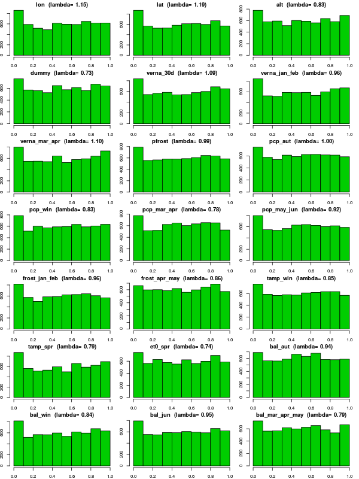
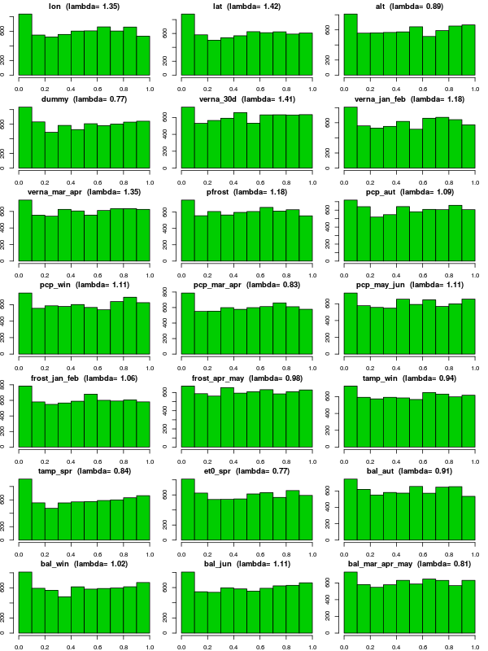
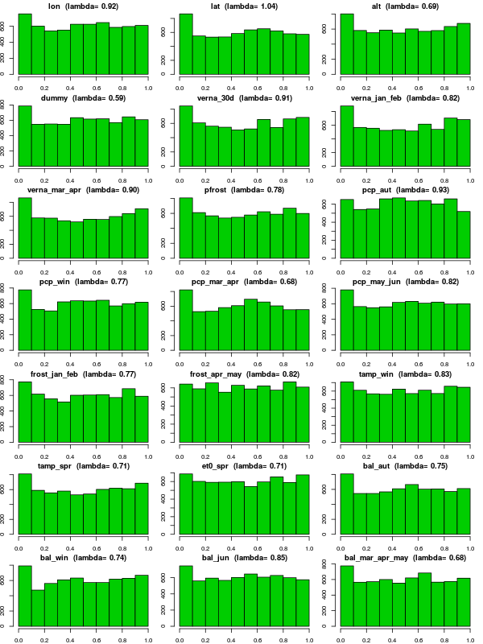

```{r knitr setup, include=FALSE,  eval=TRUE, echo=FALSE, warning=FALSE}
library(knitr)
knitr::opts_chunk$set(eval=TRUE, cache=FALSE, message=FALSE, warning=FALSE, 
                      comment = "", results="markup")
```

This document describes how SNP genotypes from the Spanish Barley Core Collection 
(SBCC) were checked and processed for further use with [LFMM](http://membres-timc.imag.fr/Olivier.Francois/lfmm) in combination with climate data.

<!-- 
Notes from software developer:

At first glance, the histograms look fine. Quick comment : summarizing 21 variables may be difficult. I suggest using a few combined variables (such as principal components).
Here is my personal check-list for association studies if it helps.

1) what is the variability observed in each environmental variable, and is it structured spatially? Do we have population samples or individuals scattered through space? (better if variable, structured spatially and individual-based).

2) what data filtering was performed on the data ? It is important that 1) the missing data are removed or imputed; 2) the data are filtered for low freq variants (MAF > 5-10%) 3) some kind of LD pruning or LD clustering is performed beforehand (for huge data sets).

3) histograms of p-values must shown. It is crucial that those histograms look flat (with a peak close to zero). If not, the tests cannot be compared on reasonable grounds.

4) Manhattan plots are useful (candidate lists and venn diagrams are not, because of LD). What is the coincidence of peaks across models (if many models)?

5) as a simple test, use a random gaussian variable as an environmental variable, or permute the existing values across your sample. Reapply all methods. Methods that don't produce super flat histograms are incorrect. Trust the other ones. Better, you could even combine them. 
-->

In the next steps we convert SNPs of SBCC barleys to fit the appropriate formats for downstream analyses. SNPs conserve sample order of climate data. 

We shall write a **SNPSFILE** containing allele counts across populations/barleys, where each SNP is represented by two lines in the file, with the counts of allele 1 on the first line and the counts for allele 2 on the second, and son on. The counts of allele 1 and allele 2 are assumed to sum to the sample size typed at this SNP in this population (i.e. the total sample size excluding missing data). This means that **PAV markers must be converted to SNP-like markers** if they are to be used.


## Formatting SNPs

We wrote a Perl script ([*SNP2LFMM.pl*](./SNP2LFMM.pl)) to carry out these formatting tasks.
For instance, a set of 9,920 Infinium and GBS markers in file [*9920_SNPs_SBCC_50K.tsv*](raw/9920_SNPs_SBCC_50K.tsv), was converted as follows, accepting **10% missing data per position** and accepting only biallelic loci with $MAF \geq 0.05$ (n=6822):
```{r, engine='bash'}
./SNP2LFMM.pl raw/9920_SNPs_SBCC_50K.tsv SBCC_order.txt \
  SBCC_9K_LFMM.tsv 2> SBCC_9K_LFMM.log 
  
./SNP2LFMM.pl raw/9920_SNPs_SBCC_50K.tsv SBCC_order_complete_env.txt \
  SBCC_9K_LFMM.complete.tsv 2> SBCC_9K_LFMM.complete.log   

perl -F'\t' -ane '$r++;for(1 .. $#F){$m[$r][$_]=$F[$_-1]};$mx=$#F;END{for(1 .. $mx){for $t(1 .. $r){print"$m[$t][$_]\t"}print"\n"}}' SBCC_9K_LFMM.tsv > SBCC_9K_LFMM.tr.tsv

perl -F'\t' -ane '$r++;for(1 .. $#F){$m[$r][$_]=$F[$_-1]};$mx=$#F;END{for(1 .. $mx){for $t(1 .. $r){print"$m[$t][$_]\t"}print"\n"}}' SBCC_9K_LFMM.complete.tsv > SBCC_9K_LFMM.complete.tr.tsv

head SBCC_9K_LFMM.log 
echo ...
tail SBCC_9K_LFMM.log
```
The resulting [*SBCC_9K_LFMM.tr.tsv*](./SBCC_9K_LFMM.tr.tsv) file is the **SNPSFILE** required by LFMM. Note that file [*SBCC_9K_LFMM.annot.tsv*](./SBCC_9K_LFMM.annot.tsv) with matching fullnames of SNPs (columns) is produced alongside.


## Imputing missing SNP data

We realised that LFMM does not cope well with missing data, as in our tests (see file [LFMMvsBAYENV.xlsx](LFMM/old/LFMMvsBAYENV.xlsx)) markers with missing data were two orders or magnitude more likely to be associated to climate vars. Therefore we used instead a dataset with imputed missing calls, 
which is contained in file [*SBCC_9K_SNPs.imputed.tsv*](SBCC_9K_SNPs.imputed.tsv). 
The following code filters out SNPs with with $MAF \geq 0.05$:

```{r, engine='bash'}
./SNPimp2LFMM.pl SBCC_9K_SNPs.imputed.tsv SBCC_order.txt \
  SBCC_9K_LFMM.imputed.tsv 2> SBCC_9K_LFMM.imputed.log

./SNPimp2LFMM.pl SBCC_9K_SNPs.imputed.tsv SBCC_order_complete_env.txt \
  SBCC_9K_LFMM.complete.imputed.tsv 2> SBCC_9K_LFMM.complete.imputed.log

perl -F'\t' -ane '$r++;for(1 .. $#F){$m[$r][$_]=$F[$_-1]};$mx=$#F;END{for(1 .. $mx){for $t(1 .. $r){print"$m[$t][$_]\t"}print"\n"}}' SBCC_9K_LFMM.imputed.tsv > SBCC_9K_LFMM.imputed.tr.tsv

perl -F'\t' -ane '$r++;for(1 .. $#F){$m[$r][$_]=$F[$_-1]};$mx=$#F;END{for(1 .. $mx){for $t(1 .. $r){print"$m[$t][$_]\t"}print"\n"}}' SBCC_9K_LFMM.complete.imputed.tsv > SBCC_9K_LFMM.complete.imputed.tr.tsv

head SBCC_9K_LFMM.imputed.log 
echo ...
tail SBCC_9K_LFMM.imputed.log
```
The resulting [*SBCC_9K_LFMM.imputed.tr.tsv*](./SBCC_9K_LFMM.imputed.tr.tsv) file is the **SNPSFILE** which will be used by LFMM (n=6128). Note that file [*SBCC_9K_LFMM.imputed.annot.tsv*](./SBCC_9K_LFMM.imputed.annot.tsv) with matching fullnames of SNPs (columns) is produced alongside.


## Test run with SNP BOPA2_12_30894 (in VrnH3 gene)

We now run a test with SNP BOPA2_12_30894, found within an intron of gene VrnH3, 
which we expected to be correlated with latitude among SBCC landraces. 

First, we will extract the relevant SNP with the previous script, parsing file [*Vrn3.txt*](raw/Vrn3.txt):

```{r, engine='bash'}
./SNP2LFMM.pl raw/9920_SNPs_SBCC_50K.tsv SBCC_order.txt Vrn3/Vrn3b.tsv \
  raw/Vrn3.txt 2> Vrn3/Vrn3b.log 

perl -F'\t' -ane '$r++;for(1 .. $#F){$m[$r][$_]=$F[$_-1]};$mx=$#F;END{for(1 .. $mx){for $t(1 .. $r){print"$m[$t][$_]\t"}print"\n"}}' Vrn3/Vrn3b.tsv > Vrn3/Vrn3b.tr.tsv  
```

Now we'll invoke LFMM with this SNP and the climate data, which was produced earlier:

```{r, engine='bash', eval=FALSE}
time ./soft/LFMM_CL_v1.4/bin/LFMM -x Vrn3/Vrn3b.tr.tsv -v SBCC_environfile.tr.tsv \
  -K 4 -p 5 -i 50000 -b 25000 -s 12345 -m -o Vrn3/Vrn3b_LFMM &> Vrn3/Vrn3b_LFMM.SBCC_environfile.log
rm -f Vrn3/Vrn3b_LFMM_s*.4.dic
cat Vrn3/Vrn3b_LFMM_s*.4.zscore
```

## Analyzing a set of SNPs

The LFMM documentation recommends using a large number of cycles (ie 10K) with a burn-in period set to at least to one-half of the total number of cycles. We increased these numbers to 50K as the authors noticed that the results were sensitive to the run-length with datasets of a few hundreds individuals and a few thousands of loci, as it is our case. Note that the number of latent factors (-K) was initially set to 4 as this is the optimal number of subpopulations detected by STRUCTURE within the SBCC:   

```{r, engine='bash', eval=FALSE}

# first with K=4
./soft/LFMM_CL_v1.5/bin/LFMM -x SBCC_9K_LFMM.imputed.tr.tsv -v SBCC_environfile.tr.tsv \
  -K 4 -p 5 -i 50000 -b 25000 -s 12345 -o SBCC_9K_LFMM.rep1 \
  &> SBCC_9K_LFMMimp.SBCC_environfile.k4.rep1.log

./soft/LFMM_CL_v1.5/bin/LFMM -x SBCC_9K_LFMM.imputed.tr.tsv -v SBCC_environfile.tr.tsv \
  -K 4 -p 5 -i 50000 -b 25000 -s 23456 -o SBCC_9K_LFMM.rep2 \
  &> SBCC_9K_LFMMimp.SBCC_environfile.k4.rep2.log

./soft/LFMM_CL_v1.5/bin/LFMM -x SBCC_9K_LFMM.imputed.tr.tsv -v SBCC_environfile.tr.tsv \
  -K 4 -p 5 -i 50000 -b 25000 -s 34567 -o SBCC_9K_LFMM.rep3 \
  &> SBCC_9K_LFMMimp.SBCC_environfile.k4.rep3.log

./soft/LFMM_CL_v1.5/bin/LFMM -x SBCC_9K_LFMM.imputed.tr.tsv -v SBCC_environfile.tr.tsv \
  -K 4 -p 5 -i 50000 -b 25000 -s 45678 -o SBCC_9K_LFMM.rep4 \
  &> SBCC_9K_LFMMimp.SBCC_environfile.k4.rep4.log

./soft/LFMM_CL_v1.5/bin/LFMM -x SBCC_9K_LFMM.imputed.tr.tsv -v SBCC_environfile.tr.tsv \
  -K 4 -p 5 -i 50000 -b 25000 -s 56789 -o SBCC_9K_LFMM.rep5 \
  &> SBCC_9K_LFMMimp.SBCC_environfile.k4.rep5.log

# move results to LFMM folder  
mv SBCC_9K_LFMM.rep* SBCC_9K_LFMMimp.*rep?.log LFMM/K4
gzip LFMM/K4/*

# now with K=6
./soft/LFMM_CL_v1.5/bin/LFMM -x SBCC_9K_LFMM.imputed.tr.tsv -v SBCC_environfile.tr.tsv \
  -K 6 -p 5 -i 50000 -b 25000 -s 12345 -o SBCC_9K_LFMM.rep1 \
  > SBCC_9K_LFMMimp.SBCC_environfile.k6.rep1.log

./soft/LFMM_CL_v1.5/bin/LFMM -x SBCC_9K_LFMM.imputed.tr.tsv -v SBCC_environfile.tr.tsv \
  -K 6 -p 5 -i 50000 -b 25000 -s 23456 -o SBCC_9K_LFMM.rep2 \
  > SBCC_9K_LFMMimp.SBCC_environfile.k6.rep2.log

./soft/LFMM_CL_v1.5/bin/LFMM -x SBCC_9K_LFMM.imputed.tr.tsv -v SBCC_environfile.tr.tsv \
  -K 6 -p 5 -i 50000 -b 25000 -s 34567 -o SBCC_9K_LFMM.rep3 \
  > SBCC_9K_LFMMimp.SBCC_environfile.k6.rep3.log

./soft/LFMM_CL_v1.5/bin/LFMM -x SBCC_9K_LFMM.imputed.tr.tsv -v SBCC_environfile.tr.tsv \
  -K 6 -p 5 -i 50000 -b 25000 -s 45678 -o SBCC_9K_LFMM.rep4 \
  > SBCC_9K_LFMMimp.SBCC_environfile.k6.rep4.log

./soft/LFMM_CL_v1.5/bin/LFMM -x SBCC_9K_LFMM.imputed.tr.tsv -v SBCC_environfile.tr.tsv \
  -K 6 -p 5 -i 50000 -b 25000 -s 56789 -o SBCC_9K_LFMM.rep5 \
  > SBCC_9K_LFMMimp.SBCC_environfile.k6.rep5.log
  
mv SBCC_9K_LFMM.rep* SBCC_9K_LFMMimp.*rep?.log LFMM/K6
gzip LFMM/K6/*

# now with K=8
./soft/LFMM_CL_v1.5/bin/LFMM -x SBCC_9K_LFMM.imputed.tr.tsv -v SBCC_environfile.tr.tsv \
  -K 8 -p 5 -i 50000 -b 25000 -s 12345 -o SBCC_9K_LFMM.rep1 \
  > SBCC_9K_LFMMimp.SBCC_environfile.k8.rep1.log

./soft/LFMM_CL_v1.5/bin/LFMM -x SBCC_9K_LFMM.imputed.tr.tsv -v SBCC_environfile.tr.tsv \
  -K 8 -p 5 -i 50000 -b 25000 -s 23456 -o SBCC_9K_LFMM.rep2 \
  > SBCC_9K_LFMMimp.SBCC_environfile.k8.rep2.log

./soft/LFMM_CL_v1.5/bin/LFMM -x SBCC_9K_LFMM.imputed.tr.tsv -v SBCC_environfile.tr.tsv \
  -K 8 -p 5 -i 50000 -b 25000 -s 34567 -o SBCC_9K_LFMM.rep3 \
  > SBCC_9K_LFMMimp.SBCC_environfile.k8.rep3.log

./soft/LFMM_CL_v1.5/bin/LFMM -x SBCC_9K_LFMM.imputed.tr.tsv -v SBCC_environfile.tr.tsv \
  -K 8 -p 5 -i 50000 -b 25000 -s 45678 -o SBCC_9K_LFMM.rep4 \
  > SBCC_9K_LFMMimp.SBCC_environfile.k8.rep4.log

./soft/LFMM_CL_v1.5/bin/LFMM -x SBCC_9K_LFMM.imputed.tr.tsv -v SBCC_environfile.tr.tsv \
  -K 8 -p 5 -i 50000 -b 25000 -s 56789 -o SBCC_9K_LFMM.rep5 \
  > SBCC_9K_LFMMimp.SBCC_environfile.k8.rep5.log
 
mv SBCC_9K_LFMM.rep* SBCC_9K_LFMMimp.*rep?.log LFMM/K8
gzip LFMM/K8/* 
```

We should now combine the correlation z-scores obtained from those 5 independent runs, using the [Fisher-Stouffer](http://membres-timc.imag.fr/Olivier.Francois/lfmm/files/note.pdf) approach recommended by the authors:

```{r}
library(qqman)
library(pracma)

# set type of map
maptype = "cM"
#maptype = "bp"

# set barley chr names
chrnames = c("1H","2H","3H","4H","5H","6H","7H")

# get names of env vars
env_var_names = read.table(file="SBCC_environfile_order.txt")

# get SNP names
snp_names = read.table(file="SBCC_9K_LFMM.imputed.annot.tsv",sep="\t",
                       col.names = c("index","SNPidentifier"))

# read genetic/bp positions of markers
if(maptype == "bp"){
  genmap = read.table(file="raw/9920_SNPs_SBCC_bp_map2017.curated.tsv",header=T)
} else{
  genmap = read.table(file="raw/9920_SNPs_SBCC_cM_map2017.curated.tsv",header=T)
}

# read neighbor candidate genes
heading_genes = read.table(file="SBCC_9K_SNPs.annotated_genes.tsv",header=F)

# set rootname of LFMM outfiles
rootname = "SBCC_9K_LFMM"

# produce multi-panel histograms to control P-values with K=4
png("plots_LFMM/Pvalue_histogram_K4.png",width=600,height=800)
par(mfrow=c(7,3),mar=c(2,1.75,1.5,1))

for (v in 1:nrow(env_var_names)){
  # combined P-values from replicates
  z.table = NULL
  combined.p.values = NULL
  for (i in 1:5){
    file.name = paste("LFMM/K4/",rootname,".rep",i,"_s",v,".4.zscore.gz",sep="")
    z.table = cbind(z.table, read.table(file.name)[,1])
  }
  z.score = apply(z.table, MARGIN = 1, median) #combines z-scores
  
  # estimate genomic inflaction 
  # http://membres-timc.imag.fr/Olivier.Francois/lfmm/files/note.pdf
  # https://www.ncbi.nlm.nih.gov/pubmed/11315092
  lambda = median(z.score^2)/0.456 
  
  # get P-values for those Z-scores
  combined.p.values = pchisq(z.score^2/lambda, df = 1, lower = F) 

  # plot the distribution of P-values
  hist(combined.p.values, col = 3, main=paste(env_var_names[v,1],
        " (lambda=",sprintf("%1.2f)",lambda)))
}  
dev.off()

# now with K=6
png("plots_LFMM/Pvalue_histogram_K6.png",width=600,height=800)
par(mfrow=c(7,3),mar=c(2,1.75,1.5,1))

for (v in 1:nrow(env_var_names)){
  # combined P-values from replicates
  z.table = NULL
  combined.p.values = NULL
  for (i in 1:5){
    file.name = paste("LFMM/K6/",rootname,".rep",i,"_s",v,".6.zscore.gz",sep="")
    z.table = cbind(z.table, read.table(file.name)[,1])
  }
  z.score = apply(z.table, MARGIN = 1, median) #combines z-scores
  lambda = median(z.score^2)/0.456 
  
  # get P-values for those Z-scores
  combined.p.values = pchisq(z.score^2/lambda, df = 1, lower = F) 

  # plot the distribution of P-values
  hist(combined.p.values, col = 3, main=paste(env_var_names[v,1],
        " (lambda=",sprintf("%1.2f)",lambda)))
}  
dev.off()

# now with K=8
png("plots_LFMM/Pvalue_histogram_K8.png",width=600,height=800)
par(mfrow=c(7,3),mar=c(2,1.75,1.5,1))

for (v in 1:nrow(env_var_names)){
  # combined P-values from replicates
  z.table = NULL
  combined.p.values = NULL
  for (i in 1:5){
    file.name = paste("LFMM/K8/",rootname,".rep",i,"_s",v,".8.zscore.gz",sep="")
    z.table = cbind(z.table, read.table(file.name)[,1])
  }
  z.score = apply(z.table, MARGIN = 1, median) #combines z-scores
  lambda = median(z.score^2)/0.456 
  
  # get P-values for those Z-scores
  combined.p.values = pchisq(z.score^2/lambda, df = 1, lower = F) 

  # plot the distribution of P-values
  hist(combined.p.values, col = 3, main=paste(env_var_names[v,1],
        " (lambda=",sprintf("%1.2f)",lambda)))
}  
dev.off()


# produce Manhattan plots and export -log10(P-values) for K=6
# as in lambda values seem better than K=4 and K=8
FDR = 0.01
outTSV1 = paste("LFMM/SBCC_9K_LFMM.FDR",FDR,".tsv", sep="")
unlink(outTSV1)

for (v in 1:nrow(env_var_names)){
  z.table = NULL
  combined.p.values = NULL
  outTSV2 = paste("LFMM/SBCC_9K_LFMM.",env_var_names[v,1],".",maptype,".tsv", sep="")
  
  for (i in 1:5){
    file.name = paste("LFMM/K6/",rootname,".rep",i,"_s",v,".6.zscore.gz",sep="")
    z.table = cbind(z.table, read.table(file.name)[,1])
  }

  z.score = apply(z.table, MARGIN = 1, median) 
  lambda = median(z.score^2)/0.456
  combined.p.values = pchisq(z.score^2/lambda, df = 1, lower = F) 
  
  # export data for this env variable
  z.score = cbind(z.score, combined.p.values)
  data.table = cbind(snp_names, z.score)
  
  data.table$index <- NULL
  data.table = merge( data.table, genmap, by="SNPidentifier")
  data.table = data.table[order(data.table$chr,data.table[maptype],decreasing=F),]
  write.table(data.table,file=outTSV2,sep="\t",row.names=F,col.names=T,quote=F)

  # calculate Benjamini-Hochberg (FDR) combined adjusted P-values
  q = FDR
  L = length(combined.p.values)
  w = which(sort(combined.p.values) < q * (1:L) / L)
  if(length(w) == 0) w = c(1)
  candidates = order(combined.p.values)[w]
  fprintf("%s\t%2.5g\n", env_var_names[v,1],
          combined.p.values[candidates[length(candidates)]], 
          file = outTSV1, append = T)

  # plot manhattan plots
  SNPs = as.data.frame(combined.p.values)
  SNPs = cbind(SNPs,snp_names$SNPidentifier)
  colnames(SNPs) = c("P-value","SNPidentifier")
  SNPs = merge( SNPs, genmap, by="SNPidentifier")
  
  mht.data = SNPs[ , c("chr","cM","P-value","SNPidentifier")]
  
  png(file=paste("plots_LFMM/",rootname,".",env_var_names[v,1],
                 ".png",sep=""),width=1200)

  manhattan(mht.data,chr="chr",bp="cM",p="P-value",snp="SNPidentifier",logp=T,
          col = c("gray10", "gray60"), chrlabs=chrnames,suggestiveline=F,
          genomewideline = -log10(combined.p.values[candidates[length(candidates)]]),
          main=env_var_names[v,1], heading_genes$V1) #c("BOPA2_12_30894"))
  dev.off()
}  
```




<!---->
<!---->

In addition to the raw agroclimatic variables we can also test association to PCAs of all the climatic variables tested:

```{r, engine='bash', eval=FALSE}

# with K=6
./soft/LFMM_CL_v1.5/bin/LFMM -x SBCC_9K_LFMM.complete.imputed.tr.tsv -v SBCC_PC_environfile.tr.tsv \
  -K 6 -p 5 -i 50000 -b 25000 -s 12345 -o SBCC_9K_LFMM.PC.rep1 \
  > SBCC_9K_LFMMimp.SBCC_PC_environfile.k6.rep1.log

./soft/LFMM_CL_v1.5/bin/LFMM -x SBCC_9K_LFMM.complete.imputed.tr.tsv -v SBCC_PC_environfile.tr.tsv \
  -K 6 -p 5 -i 50000 -b 25000 -s 23456 -o SBCC_9K_LFMM.PC.rep2 \
  > SBCC_9K_LFMMimp.SBCC_PC_environfile.k6.rep2.log

./soft/LFMM_CL_v1.5/bin/LFMM -x SBCC_9K_LFMM.complete.imputed.tr.tsv -v SBCC_PC_environfile.tr.tsv \
  -K 6 -p 5 -i 50000 -b 25000 -s 34567 -o SBCC_9K_LFMM.PC.rep3 \
  > SBCC_9K_LFMMimp.SBCC_PC_environfile.k6.rep3.log

./soft/LFMM_CL_v1.5/bin/LFMM -x SBCC_9K_LFMM.complete.imputed.tr.tsv -v SBCC_PC_environfile.tr.tsv \
  -K 6 -p 5 -i 50000 -b 25000 -s 45678 -o SBCC_9K_LFMM.PC.rep4 \
  > SBCC_9K_LFMMimp.SBCC_PC_environfile.k6.rep4.log

./soft/LFMM_CL_v1.5/bin/LFMM -x SBCC_9K_LFMM.complete.imputed.tr.tsv -v SBCC_PC_environfile.tr.tsv \
  -K 6 -p 5 -i 50000 -b 25000 -s 56789 -o SBCC_9K_LFMM.PC.rep5 \
  > SBCC_9K_LFMMimp.SBCC_PC_environfile.k6.rep5.log
  
mv SBCC_9K_LFMM.PC.rep* SBCC_9K_LFMMimp.*rep?.log LFMM/K6
gzip LFMM/K6/*
```

These data can be used to produce Manhattan plots as explained below:
```{r}
library(qqman)
library(pracma)

# set type of map
maptype = "cM"
#maptype = "bp"

# set barley chr names
chrnames = c("1H","2H","3H","4H","5H","6H","7H")

# get names of env vars
env_var_names = read.table(file="SBCC_PC_environfile_order.txt")

# get SNP names
snp_names = read.table(file="SBCC_9K_LFMM.complete.imputed.annot.tsv",sep="\t",
                       col.names = c("index","SNPidentifier"))

# read genetic/bp positions of markers
if(maptype == "bp"){
  genmap = read.table(file="raw/9920_SNPs_SBCC_bp_map2017.curated.tsv",header=T)
} else{
  genmap = read.table(file="raw/9920_SNPs_SBCC_cM_map2017.curated.tsv",header=T)
}

# read neighbor candidate genes
heading_genes = read.table(file="SBCC_9K_SNPs.annotated_genes.tsv",header=F)

# set rootname of LFMM outfiles
rootname = "SBCC_9K_LFMM.PC"

# produce Manhattan plots of PCAs
FDR = 0.01
outTSV1 = paste("LFMM/SBCC_9K_LFMM.PC.FDR",FDR,".tsv", sep="")
unlink(outTSV1)

for (v in 1:nrow(env_var_names)){
  z.table = NULL
  combined.p.values = NULL
  v
  
  outTSV2 = paste("LFMM/SBCC_9K_LFMM.PC.",env_var_names[v,1],".",maptype,".tsv", sep="")
  
  for (i in 1:5){
    file.name = paste("LFMM/K6/",rootname,".rep",i,"_s",v,".6.zscore.gz",sep="")
    z.table = cbind(z.table, read.table(file.name)[,1])
  }
  z.score = apply(z.table, MARGIN = 1, median) 
  lambda = median(z.score^2)/0.456
  combined.p.values = pchisq(z.score^2/lambda, df = 1, lower = F) 
  
  # export data for this env variable
  z.score = cbind(z.score, combined.p.values)
  data.table = cbind(snp_names, z.score)
  data.table$index <- NULL
  data.table = merge( data.table, genmap, by="SNPidentifier")
  data.table = data.table[order(data.table$chr,data.table[maptype],decreasing=F),]
  write.table(data.table,file=outTSV2,sep="\t",row.names=F,col.names=T,quote=F)

  # calculate Benjamini-Hochberg (FDR) combined adjusted P-values
  q = FDR
  L = length(combined.p.values)
  w = which(sort(combined.p.values) < q * (1:L) / L)
  if(length(w) == 0) w = c(1)
  candidates = order(combined.p.values)[w]
  fprintf("%s\t%2.5g\n", env_var_names[v,1],
          combined.p.values[candidates[length(candidates)]], 
          file = outTSV1, append = T)

  # plot manhattan plots
  SNPs = as.data.frame(combined.p.values)
  SNPs = cbind(SNPs,snp_names$SNPidentifier)
  colnames(SNPs) = c("P-value","SNPidentifier")
  SNPs = merge( SNPs, genmap, by="SNPidentifier")
  
  mht.data = SNPs[ , c("chr","cM","P-value","SNPidentifier")]
  
  png(file=paste("plots_LFMM_pc/",rootname,".",env_var_names[v,1],
                 ".png",sep=""),width=1200)

  manhattan(mht.data,chr="chr",bp="cM",p="P-value",snp="SNPidentifier",logp=T,
          col = c("gray10", "gray60"), chrlabs=chrnames,suggestiveline=F,
          genomewideline = -log10(combined.p.values[candidates[length(candidates)]]),
          main=env_var_names[v,1], heading_genes$V1) #c("BOPA2_12_30894"))
  dev.off()
}  
```