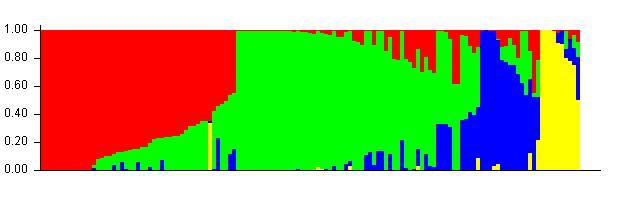

```{r knitr setup, include=FALSE,  eval=TRUE, echo=FALSE, warning=FALSE}
library(knitr)
knitr::opts_chunk$set(eval=TRUE, cache=FALSE, message=FALSE, warning=FALSE, 
                      comment = "", results="markup")
```

This document describes how SNP genotypes from 135 landraces of the Spanish Barley Core Collection (SBCC) were checked and processed for further use with [STRUCTURE](http://pritchardlab.stanford.edu/structure.html) by AM Casas.

## Formatting SNPs

We wrote a Perl script, [*SNP2STRUCTURE.pl*](./SNP2STRUCTURE.pl), to carry out this task. The initial set of 9,920 Infinium and GBS markers in file [*9920_SNPs_SBCC_50K.tsv*](raw/9920_SNPs_SBCC_50K.tsv), was converted as follows, accepting up to 10% missing data per position and accepting only biallelic loci (n=8455, after removing two htzg markers):
```{r, engine='bash', highlight=TRUE}
./SNP2STRUCTURE.pl raw/9920_SNPs_SBCC_50K.tsv SBCC_order.txt \
  SBCC_9K_SNPs.structure.tsv 2> SBCC_9K_SNPs.structure.tsv.log
tail SBCC_9K_SNPs.structure.tsv.log
```

## Inferring the population structure

After transposing [*SBCC_9K_SNPs.structure.tsv*](./SBCC_9K_SNPs.structure.tsv), 
Structure v2.3.4 was run under an admixture model, from K=1 to K=6. 
This was replicated 6x with a burn-in period of 10,000 and 20,000 Monte Carlo Markov Chain (MCMC) iterations, respectively. Evanno's $\Delta K$ was used to estimate the optimal number of subpopulations,
which was found to be K=4. The program was run one more time with a 100K burn-in and 100K MCMC iterations to assign SBCC accessions to K=4 subpopulations, as described in [doi:10.1371/journal.pone.0094688](http://journals.plos.org/plosone/article?id=10.1371/journal.pone.0094688).

The following diagram represents these populations in four colors:
 

The assignment of barley accessions to these populations can be found in file 
[SBCC_Kinship.full.tsv](raw/SBCC_Kinship.full.tsv). Landraces were allocated to 4 clusters comprising 15, 10, 49 and 61 accessions. 

As detailed in [SBCC_Kinship_clusters_K4.tsv](raw/SBCC_Kinship_clusters_K4.tsv), these assignments are almost identical
to others obtained from a previous STRUCTURE analysis performed by EEM Naheif with 6,223 Infinium SNPs (runs=10, K=1 to 6, burn-in and MCMC=10K iterations). A 0.996 Pearson correlation is observed, with all landraces assigned to the same subpopulation except SBCC054, which was assigned alternatively to subpopulations 3 and 4. 


<!--(see [SBCC_Kinship.tsv](raw/SBCC_Kinship.tsv)).-->

<!--In fact, a very similar picture of these subpopulations is obtained when analyzing a reduced set of n=384 SNPs used in previos work to characterize SBCC barleys, which are listed in file [SNPsKinship_50k.list](raw/SNPsKinship_50k.list).-->


