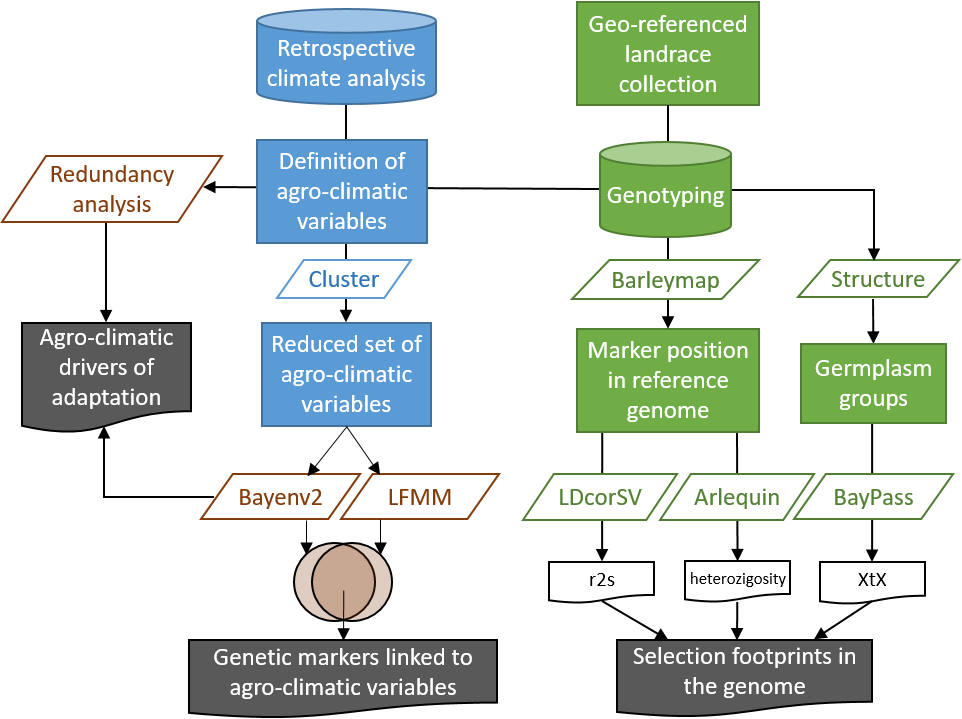

This repository contains data files and source code used in a project in which we looked for 
genome-wide association with high-resolution climate data of the Iberian Peninsula with the 
goal of discovering selection footprints in the genomes of barley landraces from the
[Spanish Barley Core Collection](http://www.eead.csic.es/barley/index.php?lng=1).

URL: [eead-csic-compbio.github.io/barley-agroclimatic-association](https://eead-csic-compbio.github.io/barley-agroclimatic-association)

**Authors**

B Contreras-Moreira (1,2), R Serrano-Notivoli (1), NE Mohamed (1), CP Cantalapiedra (1), S Begueria (1), AM Casas (1), E Igartua (1)

1. Estacion Experimental de Aula Dei-CSIC, Zaragoza, Spain
2. Fundacion ARAID, Zaragoza, Spain

There are several R markdown documents describing the selection of agroclimatic variables, 
mapping and diverse protocols for association analyses:

| filename | summary | 
|:---------|:--------:|
|[HOWTOclimate](./HOWTOclimate.html)| Preparation and selection of climate variables |
|[HOWTOstructure](./HOWTOstructure.html)| Analysis of population structure of Spanish barleys |
|[HOWTORDA](./HOWTORDA.html)| Redundancy Analysis |
|[HOWTOLD](./HOWTOLD.html)| Linkage Disequilibrium |
|[HOWTOsnps](./HOWTOsnps.html)| Association between SNPs and climate variables (Bayenv2) |
|[HOWTOsnpsLFMM](./HOWTOsnpsLFMM.html)| Association between SNPs and climate variables (LFMM) |
|[HOWTOXtX](./HOWTOXtX.html)| XtX subpopulation differentiation (Bayenv2) |
|[HOWTOXtX_BAYPASS](./HOWTOXtX_BAYPASS.html)| XtX subpopulation differentiation (BayPass) |

<!--|[HOWTOmaps.md](./HOWTOmaps.md)| Iberian maps of SNPs significantly associated to climate variables, saved in [maps/plots](./maps/plots) | -->

**Data files**

The table below describes some data files used in this work. You can find them in the repository, 
mainly at maps/, and raw/ folders, if you click on 
[View on GitHub](https://github.com/eead-csic-compbio/barley-agroclimatic-association):

| filename | description |
|:---------|:-----------:|
|[raw/barley_climate_updated.tsv](./raw/barley_climate_updated.tsv) | Values of agro-climatic and environmental variables at the geographical collection points of the barley accessions. |
|[raw/barley_climate_pca_scores.tsv](./raw/barley_climate_pca_scores.tsv) | Values of principal components of the agro-climatic and environmental variables at the geographical collection points of the barley accessions. |
|[maps/climatologies_5km.RData](./maps/climatologies_5km.RData) | 5x5 km grids of agro-climatic and environmental (lat, lon, alt) variables over Spain, required for producing the maps in [HOWTOclimate](./HOWTOclimate.html). |
|[maps/climatologies_5km_pca.RData](./maps/climatologies_5km_pca.RData) | 5x5 km grids of principal components of the agro-climatic and environmental variables over Spain, required for producing the maps in [HOWTOclimate](./HOWTOclimate.html)| 
|[matrices/SBCCmatrix_nr_mean.txt](./matrices/SBCCmatrix_nr_mean.txt) | Non-redundant covariance matrix obtained by averaging 10 Bayenv2 replicates. |
|[raw/SBCC_Kinship.full.tsv](./raw/SBCC_Kinship.full.tsv) | Tab-separated file assigning SBCC landraces to 4 subpopulations. |
|[raw/9920_SNPs_SBCC_50K.tsv](./raw/9920_SNPs_SBCC_50K.tsv) | Tab-separated matrix with SBCC biallelic SNPs. |
|[raw/9920_SNPs_SBCC_bp_map2017.curated.tsv](./raw/9920_SNPs_SBCC_bp_map2017.curated.tsv) | Tab-separated file with physical positions of SNPs assigned by [BARLEYMAP](http://floresta.eead.csic.es/barleymap) |
|[raw/9920_SNPs_SBCC_cM_map2017.curated.tsv](./raw/9920_SNPs_SBCC_cM_map2017.curated.tsv) | Tab-separated file with genetic positions of SNPs assigned by [BARLEYMAP](http://floresta.eead.csic.es/barleymap) |

**Bayenv demo **

A tar.gz file with a demo dataset to learn how to run bayenv2 locally is available at [bayenv/BAYENV_SAMPLE.tgz](./bayenv/BAYENV_SAMPLE.tgz).
It can be downloaded with: $ wget 

**Downloads**

It is possible to get the complete dataset and source code by cloning the GitHub repository; note that it takes 783MB. 

**Dependencies**

Besides [bayenv2](https://gcbias.org/bayenv) and a few Perl scripts, included in this repository,
these protocols require a few R packages which must be installed to reproduce the results:

[LDcorSV](https://cran.r-project.org/web/packages/LDcorSV/index.html),
[ape](https://cran.r-project.org/package=ape),
[calibrate](https://cran.r-project.org/package=calibrate),
[cluster](https://cran.r-project.org/package=cluster),
[corrplot](https://cran.r-project.org/package=corrplot),
[dendextend](https://cran.r-project.org/package=dendextend),
[devtools](https://cran.r-project.org/package=devtools),
[dplyr](https://cran.r-project.org/package=dplyr),
[ggplot2](https://cran.r-project.org/package=ggplot2),
[gplots](https://cran.r-project.org/package=gplots), 
[grid](https://cran.r-project.org/package=grid),
[knitr](https://cran.r-project.org/package=knitr). 
[maptools](https://cran.r-project.org/package=maptools),
[pracma](https://cran.r-project.org/package=pracma),
[qqman](https://cran.r-project.org/package=qqman),
[raster](https://cran.r-project.org/package=raster),
[vegan](https://cran.r-project.org/package=vegan).

The BayPass XtX protocol requires the system installation of [BayPass](http://www1.montpellier.inra.fr/CBGP/software/baypass).
